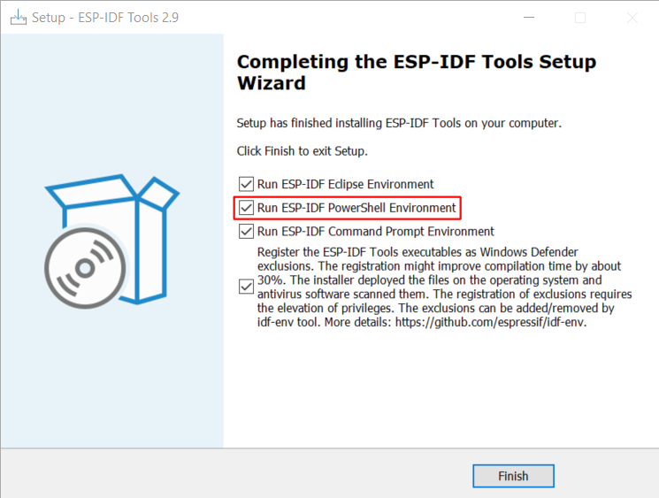
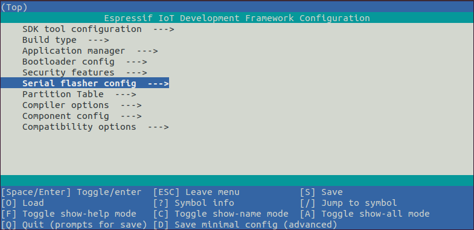
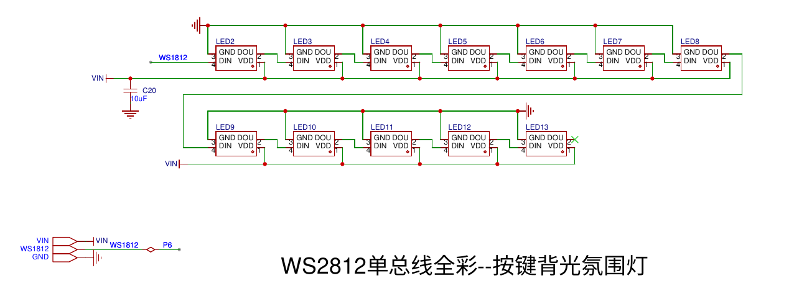
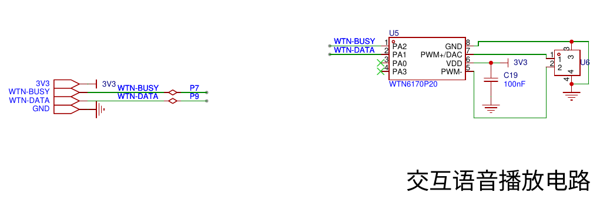
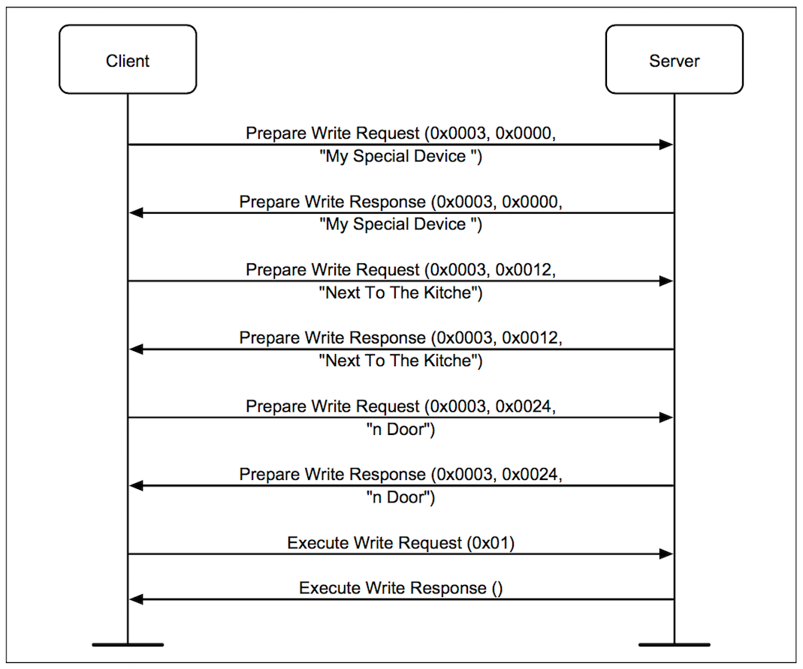
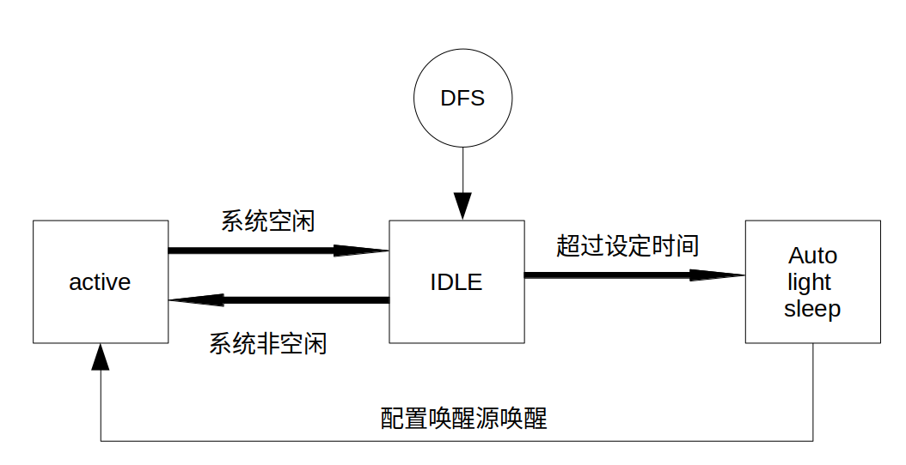
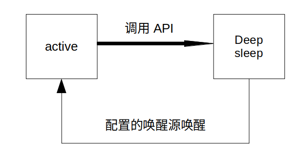

# ESP32简介

- GPIO示例代码：`examples/peripherals/gpio/generic_gpio`
- LED示例代码：`examples/peripherals/rmt/led_strip`
- 串口示例代码：`examples/peripherals/uart/uart_echo`
- 串口示例代码：`examples/peripherals/uart/uart_async_rxtxtasks`
- 蓝牙示例代码：`examples/bluetooth/bluedroid/ble/gatt_server`
- WIFI示例代码：`examples/wifi/getting_started`

ESP32-C3 SoC 芯片支持以下功能：

- 2.4 GHz Wi-Fi
- 低功耗蓝牙
- 高性能 32 位 RISC-V 单核处理器
- 多种外设
- 内置安全硬件

ESP32-C3 采用 40 nm 工艺制成，具有最佳的功耗性能、射频性能、稳定性、通用性和可靠性，适用于各种应用场景和不同功耗需求。

此芯片由上海乐鑫公司开发。

> 我们使用的芯片是 ==ESP32-C3== 。

- 51单片机：指令集是8051，8位的单片机，复杂指令集（CISC，指令不定长，汇编指令长度可能是1个字节，可能是2个字节）
- STM32：ARM指令集
  - STM32F103：指令集是ARM Cortex-M3，32位的指令集（RISC，精简指令集，汇编指令长度是定长的，4个字节）
  - STM32F407：ARM Cortex-M4，比Cortex-M3多了一些例如浮点数的计算指令
  - 苹果手机/安卓手机/高通的芯片：ARM A9指令集
- ESP32：RISC-V指令集，32位，精简指令集
- x86：CISC，复杂指令集
- MIPS：精简指令集 ==> loongarch指令集

STM32可以使用的实时系统：

- FreeRTOS
- uCos II/uCos III
- ......

ESP32只能使用FreeRTOS。

# 安装开发工具ESP-IDF

STM32的开发环境一：

- Keil：包含了armcc编译器，调试器，烧写工具，链接器，汇编器

STM32的开发环境二：

- gcc编译器
- gdb调试器
- 烧写工具：openocd
- 项目管理工具：Makefile/CMake/Ninja
- ide：Clion/VSCode/Vim/Emacs

ESP-IDF 需要安装一些必备工具，才能围绕 ESP32-C3 构建固件，包括 Python、Git、交叉编译器、CMake 和 Ninja 编译工具等。

在本入门指南中，我们通过 ==命令行== 进行有关操作。

限定条件：

- 请注意 ESP-IDF 和 ESP-IDF 工具的安装路径不能超过 90 个字符，安装路径过长可能会导致构建失败。
- Python 或 ESP-IDF 的安装路径中一定不能包含空格或括号。
- 除非操作系统配置为支持 Unicode UTF-8，否则 Python 或 ESP-IDF 的安装路径中也不能包括特殊字符（非 ASCII 码字符）
- ==各种路径中不要有中文！==

系统管理员可以通过如下方式将操作系统配置为支持 Unicode UTF-8：控制面板-更改日期、时间或数字格式-管理选项卡-更改系统地域-勾选选项 “Beta：使用 Unicode UTF-8 支持全球语言”-点击确定-重启电脑。

## 离线安装ESP-IDF

点击 `https://dl.espressif.com/dl/esp-idf/?idf=4.4` 下载离线安装包。

==ESP-IDF v5.3 - Offline Installer==


## 安装内容

安装程序会安装以下组件：

- 内置的 Python
- 交叉编译器
- 烧写工具：OpenOCD
- CMake 和 Ninja 编译工具
- ESP-IDF：类似于STM32的HAL库。

安装程序允许将程序下载到现有的ESP-IDF目录。

推荐将ESP-IDF下载到 `%userprofile%\Desktop\esp-idf`目录下，其中`%userprofile%`代表家目录。

## 启动ESP-IDF环境

安装结束时，如果勾选了 `Run ESP-IDF PowerShell Environment` 或 `Run ESP-IDF Command Prompt (cmd.exe)`，安装程序会在选定的提示符窗口启动 ESP-IDF。

Run ESP-IDF PowerShell Environment：



## 创建工程

现在，可以准备开发 ESP32 应用程序了。可以从 ESP-IDF 中 `examples` 目录下的 `get-started/hello_world` 工程开始。

Windows版的示例程序路径：

```
EspressIF/Frameworks/esp-idf-5.3/examples
```

常用的shell命令：

```sh
cd 文件夹 # 进入到某个文件夹，切换到某个文件夹
cd ..    # 退回到上一级目录
ls       # 列出当前目录中的内容
```

例如要进入到 `hello_world` 文件夹中，使用tab键补全命令

```sh
cd D:
cd EspressIF
cd Frameworks
cd esp-idf-5.3
cd examples
...
```

编译和烧写的命令：

> 注意：要使用cd命令切换到项目的文件夹中

```sh
# 芯片选型
idf.py set-target esp32c3
# 编译项目
idf.py build
# 如果电脑用户名是中文，那么编译命令是
idf.py --no-ccache build
# 烧写
idf.py flash
# 如果电脑用户名是中文，那么烧写命令是
idf.py --no-ccache flash
# 查看帮助
idf.py --help
# 烧写并打开串口助手
idf.py flash monitor
# 打开串口助手
idf.py monitor
# 退出串口助手：`Ctrl + ]`
```

flash命令是：编译+烧写

> ESP-IDF 编译系统不支持 ESP-IDF 路径或其工程路径中带有空格。

将 `get-started/hello_world` 工程复制至本地的 `~/esp` 目录下：

```
$ cd %userprofile%\esp
$ xcopy /e /i %IDF_PATH%\examples\get-started\hello_world hello_world
```

> ESP-IDF 的 examples 目录下有一系列示例工程，可以按照上述方法复制并运行其中的任何示例，也可以直接编译示例，无需进行复制。

# hello_world项目讲解

目录结构：

```
hello_world
├── CMakeLists.txt
├── main
│   ├── CMakeLists.txt
│   └── hello_world_main.c
```

项目根目录文件夹中的 `CMakeLists.txt` 如下：

```cmake
# 指定cmake的最低版本
cmake_minimum_required(VERSION 3.16)
# 在STM32开发中，需要将HAL库和FreeRTOS相关代码拷贝到项目文件夹中
# 下面一行将esp-idf的源码中的头文件和c代码包含进来
# `$ENV{IDF_PATH}` 是 esp-idf 的绝对路径
# 所以不需要将esp-idf的代码拷贝到项目文件夹中
include($ENV{IDF_PATH}/tools/cmake/project.cmake)
# 给编译好的二进制文件起一个名字，`hello_world.bin`
project(hello_world)
```

`main` 文件夹中的 `CMakeLists.txt` 如下：

```cmake
idf_component_register(
	# SRCS表示要包含的`.c`文件
	SRCS "hello_world_main.c"
	# INCLUDE_DIRS表示要包含的`.h`文件的目录
    INCLUDE_DIRS ""
)
```

`hello_world_main.c`

```c
#include <stdio.h>
#include <inttypes.h>
// esp32的配置的头文件
#include "sdkconfig.h"
// 实时系统的头文件
#include "freertos/FreeRTOS.h"
// 任务相关的头文件
#include "freertos/task.h"
// 芯片相关信息的头文件
#include "esp_chip_info.h"
// esp32自带的flash相关的头文件
#include "esp_flash.h"
// 系统信息头文件
#include "esp_system.h"

// main函数在esp-idf中，在编译的过程中，会将main函数自动包含进来，无需自己编写
// esp32的入口点函数是`app_main`
// app_main在底层是一个FreeRTOS的任务，优先级是1。
// 作用：初始化外设，创建rtos任务。
void app_main(void)
{
    // 打印到串口助手
    printf("Hello world!\n");

    /* Print chip information */
    // 声明芯片信息结构体
    esp_chip_info_t chip_info;
    uint32_t flash_size;
    // 初始化芯片信息结构体，将芯片信息填充到结构体中
    esp_chip_info(&chip_info);
    // 打印芯片信息
    printf("This is %s chip with %d CPU core(s), %s%s%s%s, ",
           CONFIG_IDF_TARGET,
           chip_info.cores, // cpu核数
           (chip_info.features & CHIP_FEATURE_WIFI_BGN) ? "WiFi/" : "",
           (chip_info.features & CHIP_FEATURE_BT) ? "BT" : "",
           (chip_info.features & CHIP_FEATURE_BLE) ? "BLE" : "",
           (chip_info.features & CHIP_FEATURE_IEEE802154) ? ", 802.15.4 (Zigbee/Thread)" : "");

    // 主设备号
    // unsigned 是 unsigned char 的简写
    unsigned major_rev = chip_info.revision / 100;
    // 从设备号
    unsigned minor_rev = chip_info.revision % 100;
    printf("silicon revision v%d.%d, ", major_rev, minor_rev);
    // 获取esp32自带的flash的大小
    if(esp_flash_get_size(NULL, &flash_size) != ESP_OK) {
        printf("Get flash size failed");
        return;
    }

    // 打印flash大小
    printf("%" PRIu32 "MB %s flash\n", flash_size / (uint32_t)(1024 * 1024),
           (chip_info.features & CHIP_FEATURE_EMB_FLASH) ? "embedded" : "external");

    // 打印最小堆的大小
    printf("Minimum free heap size: %" PRIu32 " bytes\n", esp_get_minimum_free_heap_size());

    for (int i = 10; i >= 0; i--) {
        printf("Restarting in %d seconds...\n", i);
        // 延时1秒钟
        vTaskDelay(1000 / portTICK_PERIOD_MS);
    }
    printf("Restarting now.\n");
    // 将缓冲区的内容刷写到标准输出
    fflush(stdout);
    // 重启esp32
    esp_restart();
}
```


## 连接设备

现在，请将 ESP32 开发板连接到 PC，并查看开发板使用的串口。

在 Windows 操作系统中，串口名称通常以 COM 开头。

## 配置工程

请进入 `hello_world` 目录，设置 ESP32-C3 为目标芯片，然后运行工程配置工具 menuconfig 。

```sh
cd %userprofile%\esp\hello_world
idf.py set-target esp32c3
idf.py menuconfig
```

打开一个新工程后，应首先使用 `idf.py set-target esp32c3` 设置“目标”芯片。注意，此操作将清除并初始化项目之前的编译和配置（如有）。也可以直接将“目标”配置为环境变量（此时可跳过该步骤）。

正确操作上述步骤后，系统将显示以下菜单：



可以通过此菜单设置项目的具体变量，包括 Wi-Fi 网络名称、密码和处理器速度等。`hello_world` 示例项目会以默认配置运行，因此在这一项目中，可以跳过使用 menuconfig 进行项目配置这一步骤。

## 编译工程

请使用以下命令，编译烧录工程：

```sh
idf.py build
```

运行以上命令可以编译应用程序和所有 ESP-IDF 组件，接着生成引导加载程序、分区表和应用程序二进制文件。

```sh
$ idf.py build
Running cmake in directory /path/to/hello_world/build
Executing "cmake -G Ninja --warn-uninitialized /path/to/hello_world"...
Warn about uninitialized values.
-- Found Git: /usr/bin/git (found version "2.17.0")
-- Building empty aws_iot component due to configuration
-- Component names: ...
-- Component paths: ...

... (more lines of build system output)

[527/527] Generating hello_world.bin
esptool.py v2.3.1

Project build complete. To flash, run this command:
../../../components/esptool_py/esptool/esptool.py -p (PORT) -b 921600 write_flash --flash_mode dio --flash_size detect --flash_freq 40m 0x10000 build/hello_world.bin  build 0x1000 build/bootloader/bootloader.bin 0x8000 build/partition_table/partition-table.bin
or run 'idf.py -p PORT flash'
```

如果一切正常，编译完成后将生成 `.bin` 文件。

## 烧录到设备

请运行以下命令，将刚刚生成的二进制文件烧录至 ESP32 开发板：

```sh
idf.py flash
```

> 勾选 flash 选项将自动编译并烧录工程，因此无需再运行 `idf.py build`。

## 常规操作

在烧录过程中，会看到类似如下的输出日志：

```sh
...
esptool.py --chip esp32 -p /dev/ttyUSB0 -b 460800 --before=default_reset --after=hard_reset write_flash --flash_mode dio --flash_freq 40m --flash_size 2MB 0x8000 partition_table/partition-table.bin 0x1000 bootloader/bootloader.bin 0x10000 hello_world.bin
esptool.py v3.0-dev
Serial port /dev/ttyUSB0
Connecting........_
Chip is ESP32D0WDQ6 (revision 0)
Features: WiFi, BT, Dual Core, Coding Scheme None
Crystal is 40MHz
MAC: 24:0a:c4:05:b9:14
Uploading stub...
Running stub...
Stub running...
Changing baud rate to 460800
Changed.
Configuring flash size...
Compressed 3072 bytes to 103...
Writing at 0x00008000... (100 %)
Wrote 3072 bytes (103 compressed) at 0x00008000 in 0.0 seconds (effective 5962.8 kbit/s)...
Hash of data verified.
Compressed 26096 bytes to 15408...
Writing at 0x00001000... (100 %)
Wrote 26096 bytes (15408 compressed) at 0x00001000 in 0.4 seconds (effective 546.7 kbit/s)...
Hash of data verified.
Compressed 147104 bytes to 77364...
Writing at 0x00010000... (20 %)
Writing at 0x00014000... (40 %)
Writing at 0x00018000... (60 %)
Writing at 0x0001c000... (80 %)
Writing at 0x00020000... (100 %)
Wrote 147104 bytes (77364 compressed) at 0x00010000 in 1.9 seconds (effective 615.5 kbit/s)...
Hash of data verified.

Leaving...
Hard resetting via RTS pin...
Done
```

如果一切顺利，烧录完成后，开发板将会复位，应用程序 `hello_world` 开始运行。

## 监视输出

使用 串口助手 监视输出和调试。

> 当要进行烧写时，请关闭串口助手！

# 电容键盘模块

> 电容键盘模块的参考代码位于`examples\peripherals\gpio\generic_gpio`文件夹。
>
> $I^2C$的示例代码：`examples/peripherals/i2c/i2c_tools`。

电容键盘使用 ==SC12B== 。通信协议是：$I^2C$。电路图如下：


先引入这个模块的原因是为了让大家熟悉如何操作 ESP32 的 GPIO 引脚。和 STM32 的 HAL 库的使用是类似的。

在编写代码之前，让我们先来创建项目。

- 在 ~/esp 文件夹中创建新的文件夹 atguigu-gpio-example 。
- 在 atguigu-gpio-example 文件夹中创建文件 CMakeLists.txt 。
- 在 atguigu-gpio-example 文件夹中创建 main 文件夹。
- 在 main 文件夹中创建两个文件。gpio_main.c 和 CMakeLists.txt 。

目录结构如下：

```
atguigu-gpio-example
    - CMakeLists.txt
    - main
      - CMakeLists.txt
      - gpio_main.c

```

先来编写 `atguigu-gpio-example/CMakeLists.txt` 文件。内容如下：

```cmake
# cmake版本管理工具的最小版本号
cmake_minimum_required(VERSION 3.16)

# 项目的cmake文件路径，包含在 ESP32 的 SDK 中
include($ENV{IDF_PATH}/tools/cmake/project.cmake)
# 项目名称
project(atguigu_gpio_example)
```

然后编写 `atguigu-gpio-example/main/CMakeLists.txt` 文件。内容如下：

```cmake
idf_component_register(
    # 要包含的源文件
    SRCS "gpio_main.c"
    # 要包含的路径
    INCLUDE_DIRS ""
)
```

接下来我们就可以来正式编写 `atguigu-gpio-example/main/gpio_main.c` 文件的代码了。

为了方便上手，我们把代码写在一个文件中。但是分段讲解，所以大家只需要把代码从上往下写就可以了。

```c
/// 整型定义
#include <inttypes.h>
/// RTOS通用API
#include "freertos/FreeRTOS.h"
/// RTOS任务相关API
#include "freertos/task.h"
/// RTOS队列相关API
#include "freertos/queue.h"
/// ESP32的GPIO接口
#include "driver/gpio.h"
```

接下来，我们定义一些引脚操作的宏定义，增强代码可读性。

```c
/// SCL时钟引脚 P0
#define I2C_SCL GPIO_NUM_1
/// SDA数据引脚
#define I2C_SDA GPIO_NUM_2
/// INT中断引脚
#define KEYBOARD_INT GPIO_NUM_0

/// 设置SDA引脚为输入方向
#define I2C_SDA_IN gpio_set_direction(I2C_SDA, GPIO_MODE_INPUT)
/// 设置SDA引脚为输出方向
#define I2C_SDA_OUT gpio_set_direction(I2C_SDA, GPIO_MODE_OUTPUT)

/// 拉高SCL引脚
#define I2C_SCL_H gpio_set_level(I2C_SCL, 1)
/// 拉低SCL引脚
#define I2C_SCL_L gpio_set_level(I2C_SCL, 0)

/// 拉高SDA引脚
#define I2C_SDA_H gpio_set_level(I2C_SDA, 1)
/// 拉低SDA引脚
#define I2C_SDA_L gpio_set_level(I2C_SDA, 0)

/// 读取SDA引脚电平的值
#define I2C_READ_SDA gpio_get_level(I2C_SDA)
```

定义一个单位为毫秒的延时函数。使用了 `vTaskDelay` 方法来实现这一点。

```c
void Delay_ms(uint16_t time)
{
    vTaskDelay(time / portTICK_PERIOD_MS);
}
```

接下来我们通过以上定义的方法，来实现软件 $I^2C$ 协议。因为 ESP32-C3 通过 $I^2C$ 协议和电容键盘进行通信。

由于 $I^2C$ 协议大家已经比较熟悉了，所以电平的拉高拉低以及延时不做过多讲解。

开始 $I^2C$ 通信。

```c
void I2C_Start(void)
{
    I2C_SDA_OUT;
    I2C_SDA_H;
    I2C_SCL_H;
    Delay_ms(1);
    I2C_SDA_L;
    Delay_ms(1);
    I2C_SCL_L;
    Delay_ms(1);
}
```

停止 $I^2C$ 通信。

```c
void I2C_Stop(void)
{
    I2C_SCL_L;
    I2C_SDA_OUT;
    I2C_SDA_L;
    Delay_ms(1);
    I2C_SCL_H;
    Delay_ms(1);
    I2C_SDA_H;
}
```

下发应答。

```c
void I2C_Ack(uint8_t x)
{
    I2C_SCL_L;
    I2C_SDA_OUT;
    if (x)
    {
        I2C_SDA_H;
    }
    else
    {
        I2C_SDA_L;
    }
    Delay_ms(1);
    I2C_SCL_H;
    Delay_ms(1);
    I2C_SCL_L;
}
```

等待应答信号到来。成功则返回 0 。

```c
uint8_t I2C_Wait_Ack(void)
{
    uint8_t ucErrTime = 0;
    I2C_SCL_L;
    I2C_SDA_IN;
    Delay_ms(1);
    I2C_SCL_H;
    Delay_ms(1);
    /// 一直尝试读取数据线的低电平
    while (I2C_READ_SDA)
    {
        if (ucErrTime++ > 250)
        {
            return 1;
        }
    }
    I2C_SCL_L;
    return 0;
}
```

实现发送 1 个字节的功能。

```c
void I2C_Send_Byte(uint8_t d)
{
    uint8_t t = 0;
    I2C_SDA_OUT;
    while (8 > t++)
    {
        I2C_SCL_L;
        Delay_ms(1);
        if (d & 0x80)
        {
            I2C_SDA_H;
        }
        else
        {
            I2C_SDA_L;
        }
        Delay_ms(1);
        I2C_SCL_H;
        Delay_ms(1);
        d <<= 1;
    }
}
```

实现读取 1 个字节的功能。

```c
uint8_t I2C_Read_Byte(uint8_t ack)
{
    uint8_t i = 0;
    uint8_t receive = 0;
    I2C_SDA_IN;
    for (i = 0; i < 8; i++)
    {
        I2C_SCL_L;
        Delay_ms(1);
        I2C_SCL_H;
        receive <<= 1;
        if (I2C_READ_SDA)
        {
            receive++;
        }
        Delay_ms(1);
    }
    I2C_Ack(ack);
    return receive;
}
```

实现发送数据并返回应答的功能。

```c
uint8_t SendByteAndGetNACK(uint8_t data)
{
    I2C_Send_Byte(data);
    return I2C_Wait_Ack();
}
```

实现 SC12B 电容键盘读取按键的值的方法。

```c
uint8_t I2C_Read_Key(void)
{
    I2C_Start();
    if (SendByteAndGetNACK((0x40 << 1) | 0x01))
    {
        I2C_Stop();
        return 0;
    }
    uint8_t i = 0;
    uint8_t k = 0;
    I2C_SDA_IN;
    while (8 > i)
    {
        i++;
        I2C_SCL_L;
        Delay_ms(1);
        I2C_SCL_H;
        if (!k && I2C_READ_SDA)
        {
            k = i;
        }
        Delay_ms(1);
    }
    if (k)
    {
        I2C_Ack(1);
        I2C_Stop();
        return k;
    }
    I2C_Ack(0);
    I2C_SDA_IN;
    while (16 > i)
    {
        i++;
        I2C_SCL_L;
        Delay_ms(1);
        I2C_SCL_H;
        if (!k && I2C_READ_SDA)
        {
            k = i;
        }
        Delay_ms(1);
    }
    I2C_Ack(1);
    I2C_Stop();
    return k;
}
```

注意，按到的键和显示的按键值可能不一样。例如，按了 "1" 可能返回 "77"，所以需要写代码校正。校正代码如下：

```c
uint8_t KEYBOARD_read_key(void)
{
    uint16_t key = I2C_Read_Key();
    if (key == 4)
        return 1;
    else if (key == 3)
        return 2;
    else if (key == 2)
        return 3;
    else if (key == 7)
        return 4;
    else if (key == 6)
        return 5;
    else if (key == 5)
        return 6;
    else if (key == 10)
        return 7;
    else if (key == 9)
        return 8;
    else if (key == 8)
        return 9;
    else if (key == 1)
        return 0;
    else if (key == 12)
        return '#';
    else if (key == 11)
        return 'M';
    return 255;
}
```

> 每个电容键盘的校正数值可能不一样。

好的。有关键盘的 $I^2C$ 驱动和读取按键值的代码已经写好了。

然后我们编写GPIO初始化的代码。

```c
/// GPIO初始化
void KEYBOARD_init(void)
{
    gpio_config_t io_conf;
    // 禁用中断
    io_conf.intr_type = GPIO_INTR_DISABLE;
    // 设置为输出模式
    io_conf.mode = GPIO_MODE_OUTPUT;
    // 选择要使用的引脚
    // ULL => unsigned long long
    // pin_bit_mask: 0b0000 => 0b0110
    io_conf.pin_bit_mask = ((1ULL << SC12B_SCL) | (1ULL << SC12B_SDA));
    // 禁用下拉
    io_conf.pull_down_en = 0;
    // 使能上拉
    io_conf.pull_up_en = 1;
    // 使GPIO配置生效
    gpio_config(&io_conf);

    // 中断
    // POSEDGE：上升沿，positive edge
    // NEGEDGE：下降沿，negative edge
    io_conf.intr_type = GPIO_INTR_POSEDGE;
    io_conf.mode = GPIO_MODE_INPUT;
    io_conf.pin_bit_mask = (1ULL << SC12B_INT);
    gpio_config(&io_conf);
}
```

接下来我们实现处理按键中断的代码。

首先初始化一个保存 GPIO 中断事件的队列。

```c
static QueueHandle_t gpio_event_queue = NULL;
```

然后实现响应来自 GPIO 中断的回调函数。也就是说，当我们按键时，产生的中断会触发回调函数的执行。GPIO 引脚号会作为参数传入函数。

```c
/// 当回调函数执行时，参数 arg 是产生中断的 GPIO 引脚号。
/// `IRAM_ATTR`宏定义表示回调函数在内存的某个特定位置
static void IRAM_ATTR gpio_isr_handler(void *arg)
{
    /// arg中保存了触发中断的GPIO引脚号
    uint32_t gpio_num = (uint32_t)arg;
    /// 将 GPIO 引脚号添加到 gpio_event_queue 队列中。
    xQueueSendFromISR(gpio_event_queue, &gpio_num, NULL);
}
```

接下来实现处理中断事件的逻辑。处理中断事件的方法是不断的轮询中断事件队列，从中取出事件并处理。

```c
static void process_isr(void *arg)
{
    uint32_t gpio_num;
    for (;;)
    {
        /// 如果队列中有 GPIO 中断事件，将 GPIO 引脚号存储到 gpio_num 变量中。
        if (xQueueReceive(gpio_event_queue, &gpio_num, portMAX_DELAY))
        {
            /// 如果产生中断的GPIO引脚号是 GPIO_NUM_0，也就是键盘中断引脚。
            if (gpio_num == 0)
            {
                /// 读取按键值。
                uint8_t key_num = KEYBOARD_read_key();
                /// 打印到上位机。通过串口助手查看。
                printf("press key: %d\r\n", key_num);
            }
        }
    }
}
```

很显然，`process_isr` 方法需要注册为一个 RTOS 任务。

```c
static void ISR_QUEUE_Init(void)
{
    /// 创建一个队列，用来保存中断事件。
    gpio_event_queue = xQueueCreate(10, sizeof(uint32_t));
    /// 将 process_isr 注册为一个 RTOS 任务。
    xTaskCreate(process_isr, "process_isr", 2048, NULL, 10, NULL);
    /// 启用中断
    gpio_install_isr_service(0);
    /// 来自 GPIO_NUM_0 也就是 SC12B_INT 的中断触发的回调函数是 gpio_isr_handler 。
    gpio_isr_handler_add(SC12B_INT, gpio_isr_handler, (void *)SC12B_INT);
}
```

接下来终于可以编写入口函数 ==app_main== 了。注意 ESP32 程序的入口函数是 `app_main` 。实际上这个入口函数也是被注册成了一个 RTOS 任务。

```c
void app_main(void)
{
    ISR_QUEUE_Init();
    KEYBOARD_init();
}
```

接下来，我们可以编译并烧写程序了。可以一条命令搞定。首先需要 `cd` 到项目的文件夹。例如，在我的电脑上命令如下：

```sh
cd ~/esp/atguigu-gpio-example
idf.py set-target esp32c3
idf.py flash
```

然后就可以测试程序了。

## 检测I2C设备

> `esp-idf/examples/peripherals/i2c/i2c_tools`

```sh
idf.py set-target esp32c3
idf.py menuconfig # 配置菜单
```

`Example Configuration  ---> (1) SCL GPIO Num`

` Example Configuration  ---> (2) SDA GPIO Num`

`Component config  ---> ESP System Settings  ---> Channel for console output (Default: UART0)  ---> USB Serial/JTAG Controller`

```sh
idf.py flash monitor
# 输入i2cdetect
i2c-tools> i2cdetect
     0  1  2  3  4  5  6  7  8  9  a  b  c  d  e  f
00: -- -- -- -- -- -- -- -- -- -- -- -- -- -- -- --
10: -- -- -- -- -- -- -- -- -- -- -- -- -- -- -- --
20: -- -- -- -- -- -- -- -- -- -- -- -- -- -- -- --
30: -- -- -- -- -- -- -- -- -- -- -- -- -- -- -- --
40: -- -- 42 -- -- -- -- -- -- -- -- -- -- -- -- --
50: -- -- -- -- -- -- -- -- -- -- -- -- -- -- -- --
60: -- -- -- -- -- -- -- -- -- -- -- -- -- -- -- --
70: -- -- -- -- -- -- -- -- -- -- -- -- -- -- -- --
```


# 红外遥控（RMT）

> LED模块的参考代码位于`examples/peripherals/rmt/led_strip`文件夹。

## 简介

红外遥控（RMT）外设是一个红外发射和接收控制器。其数据格式灵活，可进一步扩展为多功能的通用收发器，发送或接收多种类型的信号。就网络分层而言，RMT 硬件包含物理层和数据链路层。物理层定义通信介质和比特信号的表示方式，数据链路层定义 RMT 帧的格式。RMT 帧的最小数据单元称为 RMT 符号，在驱动程序中以 `rmt_symbol_word_t` 表示。

ESP32-C3 的 RMT 外设存在多个通道，每个通道都可以独立配置为发射器或接收器。

RMT 外设通常支持以下场景：

- 发送或接收红外信号，支持所有红外线协议，如 NEC 协议
- 生成通用序列
- 有限或无限次地在硬件控制的循环中发送信号
- 多通道同时发送
- 将载波调制到输出信号或从输入信号解调载波

## RMT符号的内存布局

RMT硬件定义了自己的数据模式，称为RMT符号。下图展示了一个 RMT 符号的位字段：每个符号由两对两个值组成，每对中的第一个值是一个 15 位的值，表示信号持续时间，以 RMT 滴答计。每对中的第二个值是一个 1 位的值，表示信号的逻辑电平，即高电平或低电平。


## RMT发射器概述

RMT 发送通道 (TX Channel) 的数据路径和控制路径如下图所示：


驱动程序将用户数据编码为 RMT 数据格式，随后由 RMT 发射器根据编码生成波形。在将波形发送到 GPIO 管脚前，还可以调制高频载波信号。

## RMT接收器概述

RMT接收通道（RX Channel）的数据路径和控制路径如下图所示：


RMT 接收器可以对输入信号采样，将其转换为 RMT 数据格式，并将数据存储在内存中。还可以向接收器提供输入信号的基本特征，使其识别信号停止条件，并过滤掉信号干扰和噪声。RMT 外设还支持从基准信号中解调出高频载波信号。

## WS2812

文件夹 `esp-idf/examples/peripherals/rmt/led_strip` 是示例代码。修改 RMT 的 GPIO 引脚就可以直接部署运行。

我们的开发板的原理是 ESP32-C3 芯片使用 RMT 模块的功能通过 GPIO 引脚发送波形。而波形是经过编码的 RGB 值。

RGB共需要24 bits数据表示。

- R: 8 bits
- G: 8 bits
- B: 8 bits

​	

原理图如下：



驱动大部分外设来说，几乎是通过 GPIO 的高低电平来处理，而 ws2812 正是需要这样的电平；RMT（远程控制）模块驱动程序可用于发送和接收红外遥控信号。由于RMT灵活性，驱动程序还可用于生成或接收许多其他类型的信号。由一系列脉冲组成的信号由RMT的发射器根据值列表生成。这些值定义脉冲持续时间和二进制级别。发射器还可以提供载波并用提供的脉冲对其进行调制；总的来说它就是一个中间件，就是通过 RMT 模块可以生成解码成包含脉冲持续时间和二进制电平的值的高低电平，从而实现发送和接收我们想要的信号。

关于这个灯珠的资料网上多的是，我总的概述：

- 每颗灯珠内置一个驱动芯片，我们只需要和这个驱动芯片通讯就可以达成调光的目的。所以，我们不需要用 PWM 调节。
- 它的管脚引出有 4 个，2 个是供电用的。还有 2 个是通讯的，DIN是输入，DOUT是输出。以及其是 5V 电压供电。
- 根据不同的厂商生产不同，驱动的方式有所不一样！下面发送数据顺序是：`GREEN -- BLUE -- RED` 。


## 代码实现

先来编写 `atguigu-led-example/CMakeLists.txt` 文件。内容如下：

```cmake
cmake_minimum_required(VERSION 3.16)

include($ENV{IDF_PATH}/tools/cmake/project.cmake)
project(atguigu_led_example)
```

然后编写 `atguigu-led-example/main/CMakeLists.txt` 文件。内容如下：

```CMake
idf_component_register(
    SRCS "led_main.c"
    INCLUDE_DIRS ""
)
```

接下来我们就可以来正式编写 `atguigu-led-example/main/led_main.c` 文件的代码了。

我们还是从上向下写代码。

首先引入一些头文件。

```c
#include <inttypes.h>
#include <string.h>
#include "freertos/FreeRTOS.h"
#include "freertos/task.h"
/// ESP32 错误处理的API
#include "esp_check.h"
/// RMT编码器相关API
#include "driver/rmt_encoder.h"
/// RMT发送数据的API
#include "driver/rmt_tx.h"
```

我们的LED条带共有12个LED灯。而LED灯需要的波形的频率很高。我们定义两个宏。

```c
// 10MHz的分辨率，1 tick = 0.1us，LED条带需要高分辨率。
#define RMT_LED_STRIP_RESOLUTION_HZ 10000000
// 只需要一个引脚，引脚号为6。
#define RMT_LED_STRIP_GPIO_NUM GPIO_NUM_6

// 共12个LED灯。
#define LED_NUMBERS 12
```

以下代码大部分来自示例代码。很多细节无需关心，只需要会修改可以实现我们的功能就可以了。

我们定义几个结构体。

```c
// LED编码器配置结构体，主要配置编码器的频率。
typedef struct
{
    uint32_t resolution;
} led_strip_encoder_config_t;

// 编码器结构体
typedef struct
{
    rmt_encoder_t base;
    rmt_encoder_t *bytes_encoder;
    rmt_encoder_t *copy_encoder;
    int state;
    rmt_symbol_word_t reset_code;
} rmt_led_strip_encoder_t;
```

初始化几个全局变量。

```c
// 日志前缀
const char *TAG = "LED ENCODER";

// 每个灯需要发送RGB三个颜色，所以一共发送的数量要乘以3。
// 这个数组用来存放待发送的RGB像素值。
uint8_t led_strip_pixels[LED_NUMBERS * 3];

// 颜色的初始值。
uint32_t red = 0;
uint32_t green = 0;
uint32_t blue = 0;
uint16_t hue = 0;

// LED通道
rmt_channel_handle_t led_chan = NULL;
// LED编码器
rmt_encoder_handle_t led_encoder = NULL;
// 发送配置，不进行循环发送
rmt_transmit_config_t tx_config = {
    .loop_count = 0,
};
```

然后编写RMT编码LED条带的代码。这部分代码来自示例程序。无需进行任何更改。

```c
size_t rmt_encode_led_strip(rmt_encoder_t *encoder, rmt_channel_handle_t channel, const void *primary_data, size_t data_size, rmt_encode_state_t *ret_state)
{
    rmt_led_strip_encoder_t *led_encoder = __containerof(encoder, rmt_led_strip_encoder_t, base);
    rmt_encoder_handle_t bytes_encoder = led_encoder->bytes_encoder;
    rmt_encoder_handle_t copy_encoder = led_encoder->copy_encoder;
    rmt_encode_state_t session_state = RMT_ENCODING_RESET;
    rmt_encode_state_t state = RMT_ENCODING_RESET;
    size_t encoded_symbols = 0;
    switch (led_encoder->state)
    {
    case 0: // send RGB data
        encoded_symbols += bytes_encoder->encode(bytes_encoder, channel, primary_data, data_size, &session_state);
        if (session_state & RMT_ENCODING_COMPLETE)
        {
            led_encoder->state = 1; // switch to next state when current encoding session finished
        }
        if (session_state & RMT_ENCODING_MEM_FULL)
        {
            state |= RMT_ENCODING_MEM_FULL;
            goto out; // yield if there's no free space for encoding artifacts
        }
    // fall-through
    case 1: // send reset code
        encoded_symbols += copy_encoder->encode(copy_encoder, channel, &led_encoder->reset_code,
                                                sizeof(led_encoder->reset_code), &session_state);
        if (session_state & RMT_ENCODING_COMPLETE)
        {
            led_encoder->state = RMT_ENCODING_RESET; // back to the initial encoding session
            state |= RMT_ENCODING_COMPLETE;
        }
        if (session_state & RMT_ENCODING_MEM_FULL)
        {
            state |= RMT_ENCODING_MEM_FULL;
            goto out; // yield if there's no free space for encoding artifacts
        }
    }
out:
    *ret_state = state;
    return encoded_symbols;
}
```

删除编码器的代码。

```c
esp_err_t rmt_del_led_strip_encoder(rmt_encoder_t *encoder)
{
    rmt_led_strip_encoder_t *led_encoder = __containerof(encoder, rmt_led_strip_encoder_t, base);
    rmt_del_encoder(led_encoder->bytes_encoder);
    rmt_del_encoder(led_encoder->copy_encoder);
    free(led_encoder);
    return ESP_OK;
}
```

重置编码器的代码。

```c
esp_err_t rmt_led_strip_encoder_reset(rmt_encoder_t *encoder)
{
    rmt_led_strip_encoder_t *led_encoder = __containerof(encoder, rmt_led_strip_encoder_t, base);
    rmt_encoder_reset(led_encoder->bytes_encoder);
    rmt_encoder_reset(led_encoder->copy_encoder);
    led_encoder->state = RMT_ENCODING_RESET;
    return ESP_OK;
}
```

新建编码器的函数。

```c
esp_err_t rmt_new_led_strip_encoder(const led_strip_encoder_config_t *config, rmt_encoder_handle_t *ret_encoder)
{
    esp_err_t ret = ESP_OK;
    rmt_led_strip_encoder_t *led_encoder = NULL;
    ESP_GOTO_ON_FALSE(config && ret_encoder, ESP_ERR_INVALID_ARG, err, TAG, "invalid argument");
    led_encoder = calloc(1, sizeof(rmt_led_strip_encoder_t));
    ESP_GOTO_ON_FALSE(led_encoder, ESP_ERR_NO_MEM, err, TAG, "no mem for led strip encoder");
    led_encoder->base.encode = rmt_encode_led_strip;
    led_encoder->base.del = rmt_del_led_strip_encoder;
    led_encoder->base.reset = rmt_led_strip_encoder_reset;
    // different led strip might have its own timing requirements, following parameter is for WS2812
    rmt_bytes_encoder_config_t bytes_encoder_config = {
        .bit0 = {
            .level0 = 1,
            .duration0 = 0.3 * config->resolution / 1000000, // T0H=0.3us
            .level1 = 0,
            .duration1 = 0.9 * config->resolution / 1000000, // T0L=0.9us
        },
        .bit1 = {
            .level0 = 1,
            .duration0 = 0.9 * config->resolution / 1000000, // T1H=0.9us
            .level1 = 0,
            .duration1 = 0.3 * config->resolution / 1000000, // T1L=0.3us
        },
        .flags.msb_first = 1 // WS2812 transfer bit order: G7...G0R7...R0B7...B0
    };
    ESP_GOTO_ON_ERROR(rmt_new_bytes_encoder(&bytes_encoder_config, &led_encoder->bytes_encoder), err, TAG, "create bytes encoder failed");
    rmt_copy_encoder_config_t copy_encoder_config = {};
    ESP_GOTO_ON_ERROR(rmt_new_copy_encoder(&copy_encoder_config, &led_encoder->copy_encoder), err, TAG, "create copy encoder failed");

    uint32_t reset_ticks = config->resolution / 1000000 * 50 / 2; // reset code duration defaults to 50us
    led_encoder->reset_code = (rmt_symbol_word_t){
        .level0 = 0,
        .duration0 = reset_ticks,
        .level1 = 0,
        .duration1 = reset_ticks,
    };
    *ret_encoder = &led_encoder->base;
    return ESP_OK;
err:
    if (led_encoder)
    {
        if (led_encoder->bytes_encoder)
        {
            rmt_del_encoder(led_encoder->bytes_encoder);
        }
        if (led_encoder->copy_encoder)
        {
            rmt_del_encoder(led_encoder->copy_encoder);
        }
        free(led_encoder);
    }
    return ret;
}
```

然后编写将 HSV 颜色转换成 RGB 颜色的代码。

```c
void led_strip_hsv2rgb(uint32_t h, uint32_t s, uint32_t v, uint32_t *r, uint32_t *g, uint32_t *b)
{
    h %= 360; // h -> [0,360]
    uint32_t rgb_max = v * 2.55f;
    uint32_t rgb_min = rgb_max * (100 - s) / 100.0f;

    uint32_t i = h / 60;
    uint32_t diff = h % 60;

    // RGB adjustment amount by hue
    uint32_t rgb_adj = (rgb_max - rgb_min) * diff / 60;

    switch (i)
    {
    case 0:
        *r = rgb_max;
        *g = rgb_min + rgb_adj;
        *b = rgb_min;
        break;
    case 1:
        *r = rgb_max - rgb_adj;
        *g = rgb_max;
        *b = rgb_min;
        break;
    case 2:
        *r = rgb_min;
        *g = rgb_max;
        *b = rgb_min + rgb_adj;
        break;
    case 3:
        *r = rgb_min;
        *g = rgb_max - rgb_adj;
        *b = rgb_max;
        break;
    case 4:
        *r = rgb_min + rgb_adj;
        *g = rgb_min;
        *b = rgb_max;
        break;
    default:
        *r = rgb_max;
        *g = rgb_min;
        *b = rgb_max - rgb_adj;
        break;
    }
}
```

然后编写 RMT 初始化的代码。

```c
void RMT_Init(void)
{
    rmt_tx_channel_config_t tx_chan_config = {
        .clk_src = RMT_CLK_SRC_DEFAULT, // 选择时钟源
        .gpio_num = RMT_LED_STRIP_GPIO_NUM, // GPIO引脚设置
        .mem_block_symbols = 64, // increase the block size can make the LED less flickering
        .resolution_hz = RMT_LED_STRIP_RESOLUTION_HZ,
        .trans_queue_depth = 4, // set the number of transactions that can be pending in the background
    };
    ESP_ERROR_CHECK(rmt_new_tx_channel(&tx_chan_config, &led_chan));

    led_strip_encoder_config_t encoder_config = {
        .resolution = RMT_LED_STRIP_RESOLUTION_HZ,
    };
    ESP_ERROR_CHECK(rmt_new_led_strip_encoder(&encoder_config, &led_encoder));

    ESP_ERROR_CHECK(rmt_enable(led_chan));
}
```

以上代码基本都是来自示例代码。接下来我们自己写点亮某一个灯的代码。

```c
void light_led(uint8_t led_num)
{
    for (int i = 0; i < 3; i++)
    {
        // 构建 RGB 像素值。
        hue = led_num * 360 / LED_NUMBERS;
        led_strip_hsv2rgb(hue, 30, 30, &red, &green, &blue);
        led_strip_pixels[led_num * 3 + 0] = green;
        led_strip_pixels[led_num * 3 + 1] = blue;
        led_strip_pixels[led_num * 3 + 2] = red;
    }

    // 将 RGB 像素值发送到 LED 灯。
    ESP_ERROR_CHECK(rmt_transmit(led_chan, led_encoder, led_strip_pixels, sizeof(led_strip_pixels), &tx_config));
    ESP_ERROR_CHECK(rmt_tx_wait_all_done(led_chan, portMAX_DELAY));

    vTaskDelay(100 / portTICK_PERIOD_MS);

    // 将像素数组置为0。
    memset(led_strip_pixels, 0, sizeof(led_strip_pixels));

    // 再次发送RGB像素值，熄灭LED灯。
    ESP_ERROR_CHECK(rmt_transmit(led_chan, led_encoder, led_strip_pixels, sizeof(led_strip_pixels), &tx_config));
    ESP_ERROR_CHECK(rmt_tx_wait_all_done(led_chan, portMAX_DELAY));
}
```

然后编写入口函数。

```c
void Delay_ms(uint32_t time)
{
    vTaskDelay(time / portTICK_PERIOD_MS);
}

void app_main(void)
{
    RMT_Init();
    for (int i = 0; i < LED_NUMBERS; i++)
    {
        light_led(i);
        Delay_ms(1000);
    }
}
```

然后编译并烧写程序。

```c
cd ~/esp/atguigu-led-example
idf.py set-target esp32c3
idf.py flash
```

# 语音模块

我们使用 WTN6170 作为语音模块外设。可以使用一根 GPIO 线来控制 WTN6170 。



我们直接给出主程序代码，大家可以练习一下如何构建项目并编译烧写。参考前两个例子即可。

```c
#include "driver/gpio.h"
#include "sys/unistd.h"
#include "esp_log.h"
#include "freertos/FreeRTOS.h"
#include "freertos/task.h"

#define DELAY_US(i) usleep(i) // usleep(i)

#define DELAY_MS(i) vTaskDelay(i / portTICK_PERIOD_MS)

#define AUDIO_SDA_PIN GPIO_NUM_9
#define AUDIO_BUSY_PIN GPIO_NUM_7

#define AUDIO_SDA_H gpio_set_level(AUDIO_SDA_PIN, 1)
#define AUDIO_SDA_L gpio_set_level(AUDIO_SDA_PIN, 0)

#define AUDIO_READ_BUSY gpio_get_level(AUDIO_BUSY_PIN)

void AUDIO_Play(uint8_t byte)
{
    /// 先拉高2ms
    gpio_set_level(AUDIO_DATA_PIN, 1);
    DelayMs(2);
    // 拉低10ms
    gpio_set_level(AUDIO_DATA_PIN, 0);
    DelayMs(10);
    for (int i = 0; i < 8; i++)
    {
        if (byte & 0b00000001)
        {
            gpio_set_level(AUDIO_DATA_PIN, 1);
            DelayUs(600);
            gpio_set_level(AUDIO_DATA_PIN, 0);
            DelayUs(200);
        }
        else
        {
            gpio_set_level(AUDIO_DATA_PIN, 1);
            DelayUs(200);
            gpio_set_level(AUDIO_DATA_PIN, 0);
            DelayUs(600);
        }
        byte >>= 1;
    }
    // 拉高2ms
    gpio_set_level(AUDIO_DATA_PIN, 1);
    DelayMs(2);
}

void AUDIO_Test(void)
{
    Line_1A_WT588F(85);
    DELAY_MS(2000);
    Line_1A_WT588F(86);
    DELAY_MS(2000);
    Line_1A_WT588F(69);
    DELAY_MS(2000);
}

void AUDIO_Init(void)
{
    gpio_config_t io_conf = {};
    io_conf.intr_type = GPIO_INTR_DISABLE;
    io_conf.mode = GPIO_MODE_OUTPUT;
    io_conf.pin_bit_mask = (1ULL << AUDIO_SDA_PIN);
    gpio_config(&io_conf);

    io_conf.intr_type = GPIO_INTR_DISABLE;
    io_conf.mode = GPIO_MODE_INPUT;
    io_conf.pin_bit_mask = (1ULL << AUDIO_BUSY_PIN);
    gpio_config(&io_conf);
}

void app_main(void)
{
    AUDIO_Init();
    AUDIO_Test();
}
```

# 电机驱动

电机用来开关锁。也就是通过驱动电机进行正转反转来开关锁。

当然我们还是通过 GPIO 的拉高拉低来驱动电机。比较简单。

电路图如下：


由于驱动电机只涉及到GPIO的基本操作，所以这里我们只给出两个关键代码。需要大家补全剩下的代码。并驱动电机转起来。

```c
#define MOTOR_DRIVER_NUM_0 GPIO_NUM_4
#define MOTOR_DRIVER_NUM_1 GPIO_NUM_5

void MOTOR_Init(void)
{
    gpio_config_t io_conf;
    io_conf.intr_type = GPIO_INTR_DISABLE;
    io_conf.mode = GPIO_MODE_OUTPUT;
    io_conf.pin_bit_mask = ((1ULL << MOTOR_DRIVER_NUM_0) | (1ULL << MOTOR_DRIVER_NUM_1));
    gpio_config(&io_conf);

    gpio_set_level(MOTOR_DRIVER_NUM_0, 0);
    gpio_set_level(MOTOR_DRIVER_NUM_1, 0);
}
```

开锁代码

```c
void MOTOR_Open_lock(void)
{
    // 正转 1 秒
    gpio_set_level(MOTOR_DRIVER_NUM_0, 0);
    gpio_set_level(MOTOR_DRIVER_NUM_1, 1);
    vTaskDelay(1000 / portTICK_PERIOD_MS);

    // 停止 1 秒
    gpio_set_level(MOTOR_DRIVER_NUM_0, 0);
    gpio_set_level(MOTOR_DRIVER_NUM_1, 0);
    vTaskDelay(1000 / portTICK_PERIOD_MS);

    // 反转 1 秒
    gpio_set_level(MOTOR_DRIVER_NUM_0, 1);
    gpio_set_level(MOTOR_DRIVER_NUM_1, 0);
    vTaskDelay(1000 / portTICK_PERIOD_MS);

    // 停止转动并播报语音
    gpio_set_level(MOTOR_DRIVER_NUM_0, 0);
    gpio_set_level(MOTOR_DRIVER_NUM_1, 0);
    Line_1A_WT588F(25);
}
```

# 串口通信

> 示例代码位置：`examples/peripherals/uart/uart_echo`

ESP32使用串口和指纹模块进行通信。电路图如下：


## 串口收发简单示例

我们先来写一个简单的串口示例程序。

```c
#include "freertos/FreeRTOS.h"
#include "freertos/task.h"
#include "esp_system.h"
#include "esp_log.h"
#include "driver/uart.h"
#include "string.h"
#include "driver/gpio.h"

static const int RX_BUF_SIZE = 1024;

#define TXD_PIN (GPIO_NUM_21)
#define RXD_PIN (GPIO_NUM_20)

void init(void)
{
    const uart_config_t uart_config = {
        .baud_rate = 115200,
        .data_bits = UART_DATA_8_BITS,
        .parity = UART_PARITY_DISABLE,
        .stop_bits = UART_STOP_BITS_1,
        .flow_ctrl = UART_HW_FLOWCTRL_DISABLE,
        .source_clk = UART_SCLK_DEFAULT,
    };
    // We won't use a buffer for sending data.
    uart_driver_install(UART_NUM_1, RX_BUF_SIZE * 2, 0, 0, NULL, 0);
    uart_param_config(UART_NUM_1, &uart_config);
    uart_set_pin(UART_NUM_1, TXD_PIN, RXD_PIN, UART_PIN_NO_CHANGE, UART_PIN_NO_CHANGE);
}

int sendData(const char *logName, const char *data)
{
    const int len = strlen(data);
    const int txBytes = uart_write_bytes(UART_NUM_1, data, len);
    ESP_LOGI(logName, "Wrote %d bytes", txBytes);
    return txBytes;
}

static void tx_task(void *arg)
{
    static const char *TX_TASK_TAG = "TX_TASK";
    esp_log_level_set(TX_TASK_TAG, ESP_LOG_INFO);
    while (1)
    {
        sendData(TX_TASK_TAG, "Hello world");
        vTaskDelay(2000 / portTICK_PERIOD_MS);
    }
}

static void rx_task(void *arg)
{
    static const char *RX_TASK_TAG = "RX_TASK";
    esp_log_level_set(RX_TASK_TAG, ESP_LOG_INFO);
    uint8_t *data = (uint8_t *)malloc(RX_BUF_SIZE + 1);
    while (1)
    {
        const int rxBytes = uart_read_bytes(UART_NUM_1, data, RX_BUF_SIZE, 1000 / portTICK_PERIOD_MS);
        if (rxBytes > 0)
        {
            data[rxBytes] = 0;
            ESP_LOGI(RX_TASK_TAG, "Read %d bytes: '%s'", rxBytes, data);
            ESP_LOG_BUFFER_HEXDUMP(RX_TASK_TAG, data, rxBytes, ESP_LOG_INFO);
        }
    }
    free(data);
}

void app_main(void)
{
    init();
    xTaskCreate(rx_task, "uart_rx_task", 1024 * 2, NULL, configMAX_PRIORITIES, NULL);
    xTaskCreate(tx_task, "uart_tx_task", 1024 * 2, NULL, configMAX_PRIORITIES - 1, NULL);
}
```

有了以上的基础，我们就可以来实现指纹模块的驱动程序了。

## 指纹模块

我们先来写头文件

```c
#ifndef __FINGERPRINT_DRIVER_H_
#define __FINGERPRINT_DRIVER_H_

#include "driver/uart.h"
#include "driver/gpio.h"

/// 下面的配置可以直接写死，也可以在 menuconfig 里面配置
#define UART_TX_PIN 21
#define UART_RX_PIN 20

#define BUF_SIZE 1024

#define FINGER_TOUCH_INT 10

/// 初始化指纹模块
void FINGERPRINT_Init(void);

/// 获取指纹芯片的序列号
void get_chip_sn(void);

/// 获取指纹图像
int get_image(void);

/// 获取指纹特征
int gen_char(void);

/// 搜索指纹
int search(void);

/// 读取指纹芯片配置参数
void read_sys_params(void);

#endif
```

然后编写头文件中接口的实现

```c
#include "fingerprint_driver.h"

void FINGERPRINT_Init(void)
{
    /* Configure parameters of an UART driver,
     * communication pins and install the driver */
    uart_config_t uart_config = {
        .baud_rate = 57600,
        .data_bits = UART_DATA_8_BITS,
        .parity = UART_PARITY_DISABLE, // 禁用奇偶校验
        .stop_bits = UART_STOP_BITS_1, // 停止位1位
        .flow_ctrl = UART_HW_FLOWCTRL_DISABLE,
        .source_clk = UART_SCLK_DEFAULT,
    };
    int intr_alloc_flags = 0;

    uart_driver_install(
        UART_NUM_1,
        BUF_SIZE * 2, 0, 0, NULL,
        intr_alloc_flags);
    uart_param_config(UART_NUM_1, &uart_config);
    // 为串口1分配tx和rx引脚
    uart_set_pin(
        UART_NUM_1,
        UART_TX_PIN,
        UART_RX_PIN,
        UART_PIN_NO_CHANGE,
        UART_PIN_NO_CHANGE);

    // 中断
    gpio_config_t io_conf;
    io_conf.intr_type = GPIO_INTR_NEGEDGE;
    io_conf.mode = GPIO_MODE_INPUT;
    io_conf.pin_bit_mask = (1ULL << TOUCH_INT);
    io_conf.pull_up_en = 1;
    gpio_config(&io_conf);

    printf("指纹模块初始化成功。\r\n");
}

void get_chip_sn(void)
{
    vTaskDelay(200 / portTICK_PERIOD_MS);
    uint8_t *data = (uint8_t *)malloc(BUF_SIZE);

    // 获取芯片唯一序列号 0x34。确认码=00H 表示 OK；确认码=01H 表示收包有错。
    uint8_t PS_GetChipSN[13] = {0xEF, 0x01, 0xFF, 0xFF, 0xFF, 0xFF, 0x01, 0x00, 0x04, 0x34, 0x00, 0x00, 0x39};
    uart_write_bytes(UART_NUM_1, (const char *)PS_GetChipSN, 13);

    // Read data from the UART
    int len = uart_read_bytes(UART_NUM_1, data, (BUF_SIZE - 1), 2000 / portTICK_PERIOD_MS);

    if (len)
    {
        if (data[6] == 0x07 && data[9] == 0x00)
        {
            printf("chip sn: %.32s\r\n", &data[10]);
        }
    }

    free(data);
}

// 检测是否有手指放在模组上面
int get_image(void)
{
    uint8_t *data = (uint8_t *)malloc(BUF_SIZE);

    // 验证用获取图像 0x01，验证指纹时，探测手指，探测到后录入指纹图像存于图像缓冲区。返回确认码表示：录入成功、无手指等。
    uint8_t PS_GetImageBuffer[12] = {0xEF, 0x01, 0xFF, 0xFF, 0xFF, 0xFF, 0x01, 0x00, 0x03, 0x01, 0x00, 0x05};

    uart_write_bytes(UART_NUM_1, (const char *)PS_GetImageBuffer, 12);

    int len = uart_read_bytes(UART_NUM_1, data, (BUF_SIZE - 1), 2000 / portTICK_PERIOD_MS);

    int result = 0xFF;

    if (len)
    {
        if (data[6] == 0x07)
        {
            if (data[9] == 0x00)
            {
                result = 0;
            }
            else if (data[9] == 0x01)
            {
                result = 1;
            }
            else if (data[9] == 0x02)
            {
                result = 2;
            }
        }
    }

    free(data);

    return result;
}

int gen_char(void)
{
    uint8_t *data = (uint8_t *)malloc(BUF_SIZE);

    // 生成特征 0x02，将图像缓冲区中的原始图像生成指纹特征文件存于模板缓冲区。
    uint8_t PS_GenCharBuffer[13] = {0xEF, 0x01, 0xFF, 0xFF, 0xFF, 0xFF, 0x01, 0x00, 0x04, 0x02, 0x01, 0x00, 0x08};

    uart_write_bytes(UART_NUM_1, (const char *)PS_GenCharBuffer, 13);

    int len = uart_read_bytes(UART_NUM_1, data, (BUF_SIZE - 1), 2000 / portTICK_PERIOD_MS);

    int result = 0xFF;

    if (len)
    {
        if (data[6] == 0x07)
        {
            result = data[9];
        }
    }

    free(data);

    return result;
}

int search(void)
{
    uint8_t *data = (uint8_t *)malloc(BUF_SIZE);

    // 搜索指纹 0x04，以模板缓冲区中的特征文件搜索整个或部分指纹库。若搜索到，则返回页码。加密等级设置为 0 或 1 情况下支持此功能。
    uint8_t PS_SearchBuffer[17] = {0xEF, 0x01, 0xFF, 0xFF, 0xFF, 0xFF, 0x01, 0x00, 0x08, 0x04, 0x01, 0x00, 0x00, 0xFF, 0xFF, 0x02, 0x0C};

    uart_write_bytes(UART_NUM_1, (const char *)PS_SearchBuffer, 17);

    int len = uart_read_bytes(UART_NUM_1, data, (BUF_SIZE - 1), 2000 / portTICK_PERIOD_MS);

    int result = 0xFF;

    if (len)
    {
        if (data[6] == 0x07)
        {
            result = data[9];
        }
    }

    free(data);

    return result;
}

void read_sys_params(void)
{
    uint8_t *data = (uint8_t *)malloc(BUF_SIZE);

    // 获取模组基本参数 0x0F，读取模组的基本参数（波特率，包大小等）。参数表前 16 个字节存放了模组的基本通讯和配置信息，称为模组的基本参数。
    uint8_t PS_ReadSysPara[12] = {0xEF, 0x01, 0xFF, 0xFF, 0xFF, 0xFF, 0x01, 0x00, 0x03, 0x0F, 0x00, 0x13};

    uart_write_bytes(UART_NUM_1, (const char *)PS_ReadSysPara, 12);

    int len = uart_read_bytes(UART_NUM_1, data, (BUF_SIZE - 1), 2000 / portTICK_PERIOD_MS);

    if (len)
    {
        if (data[6] == 0x07)
        {
            if (data[9] == 0x00)
            {
                int register_count = (data[10] << 8) | data[11];
                printf("register count ==> %d\r\n", register_count);
                int fingerprint_template_size = (data[12] << 8) | data[13];
                printf("finger print template size ==> %d\r\n", fingerprint_template_size);
                int fingerprint_library_size = (data[14] << 8) | data[15];
                printf("finger print library size ==> %d\r\n", fingerprint_library_size);
                int score_level = (data[16] << 8) | data[17];
                printf("score level ==> %d\r\n", score_level);
                // device address
                printf("device address ==> 0x");
                for (int i = 0; i < 4; i++)
                {
                    printf("%02X ", data[18 + i]);
                }
                printf("\r\n");
                // data packet size
                int packet_size = (data[22] << 8) | data[23];
                if (packet_size == 0)
                {
                    printf("packet size ==> 32 bytes\r\n");
                }
                else if (packet_size == 1)
                {
                    printf("packet size ==> 64 bytes\r\n");
                }
                else if (packet_size == 2)
                {
                    printf("packet size ==> 128 bytes\r\n");
                }
                else if (packet_size == 3)
                {
                    printf("packet size ==> 256 bytes\r\n");
                }
                // baud rate
                int baud_rate = (data[24] << 8) | data[25];
                printf("baud rate ==> %d\r\n", 9600 * baud_rate);
            }
            else if (data[9] == 0x01)
            {
                printf("send packet error\r\n");
            }
        }
    }

    free(data);
}
```

# 蓝牙模块

> 蓝牙模块的参考代码位于`examples/bluetooth/bluedroid/ble/gatt_server`文件夹。

实现了蓝牙功能和我们后面的 WIFI 功能，其实就可以自己编写代码作为固件烧录到 ESP32C3 里面了。这样也可以作为 STM32 的外设来使用了。这是 ESP32 所具有的独特的功能。

蓝牙技术是一种无线通讯技术，广泛用于短距离内的数据交换。在蓝牙技术中，"Bluedroid"和"BLE"（Bluetooth Low Energy）是两个重要的概念，它们分别代表了蓝牙技术的不同方面。

**Bluedroid**

Bluedroid是Android操作系统用于实现蓝牙功能的软件栈。在Android 4.2版本中引入，Bluedroid取代了之前的BlueZ作为Android平台的蓝牙协议栈。Bluedroid是由Broadcom公司开发并贡献给Android开源项目的（AOSP），它支持经典蓝牙以及蓝牙低功耗（BLE）。

Bluedroid协议栈设计目的是为了提供一个更轻量级、更高效的蓝牙协议栈，以适应移动设备对资源的紧张需求。它包括了蓝牙核心协议、各种蓝牙配置文件（如HSP、A2DP、AVRCP等）和BLE相关的服务和特性。

**BLE（Bluetooth Low Energy）**

BLE，即蓝牙低功耗技术，是蓝牙4.0规范中引入的一项重要技术。与传统的蓝牙技术（现在通常称为经典蓝牙）相比，BLE主要设计目标是实现极低的功耗，以延长设备的电池使用寿命，非常适合于需要长期运行但只需偶尔传输少量数据的应用场景，如健康和健身监测设备、智能家居设备等。

BLE实现了一套与经典蓝牙不同的通信协议，包括低功耗的物理层、链路层协议以及应用层协议。BLE设备可以以极低的能耗状态长时间待机，只有在需要通信时才唤醒，这使得使用小型电池的设备也能达到数月甚至数年的电池寿命。

总的来说，Bluedroid是Android平台上用于实现蓝牙通信功能的软件栈，而BLE则是蓝牙技术中的一种用于实现低功耗通信的标准。两者共同为Android设备提供了广泛的蓝牙通信能力，满足了不同应用场景下的需求。

## GATT SERVER 代码讲解

> 运行示例代码步骤：
>
> ```sh
> idf.py set-target esp32c3
> idf.py menuconfig
> # Component config  ---> Bluetooth  ---> Bluedroid Options
> # [ ] Enable BLE 5.0 features
> # [*] Enable BLE 4.2 features
> idf.py flash monitor
> ```
>
> 

在本文档中，我们回顾了在ESP32上实现蓝牙低功耗（BLE）通用属性配置文件（GATT）服务器的GATT SERVER示例代码。这个示例围绕两个应用程序配置文件和一系列事件设计，这些事件被处理以执行一系列配置步骤，例如定义广告参数、更新连接参数以及创建服务和特性。此外，这个示例处理读写事件，包括一个写长特性请求，它将传入数据分割成块，以便数据能够适应属性协议（ATT）消息。本文档遵循程序工作流程，并分解代码以便理解每个部分和实现背后的原因。

### 头文件

```c
#include <stdio.h>
#include <stdlib.h>
#include <string.h>
#include "freertos/FreeRTOS.h"
#include "freertos/task.h"
#include "freertos/event_groups.h"
#include "esp_system.h"
#include "esp_log.h"
#include "nvs_flash.h"
#include "esp_bt.h"
#include "esp_gap_ble_api.h"
#include "esp_gatts_api.h"
#include "esp_bt_defs.h"
#include "esp_bt_main.h"
#include "esp_gatt_common_api.h"
#include "sdkconfig.h"
```

这些头文件是运行FreeRTOS和底层系统组件所必需的，包括日志功能和一个用于在非易失性闪存中存储数据的库（也就是 flash）。我们对 `esp_bt.h`、`esp_bt_main.h`、`esp_gap_ble_api.h` 和 `esp_gatts_api.h` 特别感兴趣，这些文件暴露了实现此示例所需的BLE API。

- `esp_bt.h`：从主机侧实现蓝牙控制器和VHCI配置程序。
- `esp_bt_main.h`：实现Bluedroid栈协议的初始化和启用。
- `esp_gap_ble_api.h`：实现GAP配置，如广告和连接参数。
- `esp_gatts_api.h`：实现GATT配置，如创建服务和特性。

> VHCI（Virtual Host Controller Interface）是一个虚拟的主机控制器接口，它通常用于软件或硬件模拟中，以模拟主机控制器的行为。在不同的上下文中，VHCI可以指代不同的技术或应用，但基本概念相似，都是提供一个虚拟的接口来模拟实际的硬件或软件行为。
>
> 在蓝牙技术领域，VHCI特别指向用于模拟蓝牙主机控制器（Host Controller）的接口。这可以用于蓝牙协议栈的开发和测试，允许开发者在没有实际蓝牙硬件的情况下模拟蓝牙设备的行为。通过VHCI，软件可以模拟发送和接收蓝牙数据包，从而测试蓝牙应用程序和服务的实现。
>
> 在其他情况下，VHCI也可以用于USB（通用串行总线）技术，作为一个虚拟的USB主机控制器，来模拟USB设备的连接和通信。

总的来说，VHCI是一个非常有用的工具，特别是在设备驱动和协议栈开发的早期阶段，它可以帮助开发者在没有实际硬件的情况下进行软件开发和测试。

### 入口函数

入口函数是 `app_main()` 函数。

```c
void app_main(void)
{
    esp_err_t ret;

    // 初始化flash
    ret = nvs_flash_init();
    if (ret == ESP_ERR_NVS_NO_FREE_PAGES || ret == ESP_ERR_NVS_NEW_VERSION_FOUND)
    {
        // 擦除flash
        nvs_flash_erase();
        // 再一次初始化
        ret = nvs_flash_init();
    }
	// 释放相关内存
    esp_bt_controller_mem_release(ESP_BT_MODE_CLASSIC_BT);
	// 生成一份蓝牙控制器的默认配置
    esp_bt_controller_config_t bt_cfg = BT_CONTROLLER_INIT_CONFIG_DEFAULT();
    // 使用默认配置初始化蓝牙控制器
    esp_bt_controller_init(&bt_cfg);
	// 使能BLE低功耗模式
    esp_bt_controller_enable(ESP_BT_MODE_BLE);
    // 初始化bluedroid软件栈
    esp_bluedroid_init();
    // 使能bluedroid软件栈
    esp_bluedroid_enable();
    // 注册一个处理gatts事件的回调函数
    esp_ble_gatts_register_callback(gatts_event_handler);
    // 注册一个处理gap事件的回调函数
    esp_ble_gap_register_callback(gap_event_handler);
    // 注册一个处理`应用A`的回调函数
    esp_ble_gatts_app_register(PROFILE_A_APP_ID);
    // 注册一个处理`应用B`的回调函数
    esp_ble_gatts_app_register(PROFILE_B_APP_ID);
    esp_ble_gatt_set_local_mtu(500);

    return;
}
```

主函数首先初始化非易失性存储库。这个库允许在flash中保存键值对，并被一些组件（如Wi-Fi库）用来保存SSID和密码：

```c
ret = nvs_flash_init();
```

### 蓝牙控制器和栈协议初始化(BT Controller and Stack Initialization)

主函数还通过首先创建一个名为 `esp_bt_controller_config_t` 的蓝牙控制器配置结构体来初始化蓝牙控制器，该结构体使用 `BT_CONTROLLER_INIT_CONFIG_DEFAULT()` 宏生成的默认设置。蓝牙控制器在控制器侧实现了主控制器接口（HCI）、链路层（LL）和物理层（PHY）。蓝牙控制器对用户应用程序是不可见的，它处理BLE栈协议的底层。控制器配置包括设置蓝牙控制器栈协议大小、优先级和HCI波特率。使用创建的设置，通过 `esp_bt_controller_init()` 函数初始化并启用蓝牙控制器：

```c
esp_bt_controller_config_t bt_cfg = BT_CONTROLLER_INIT_CONFIG_DEFAULT();
ret = esp_bt_controller_init(&bt_cfg);
```

接下来，控制器使能为 BLE 模式。

```c
esp_bt_controller_enable(ESP_BT_MODE_BLE);
```

> 如果想要使用双模式（BLE + BT），控制器应该使能为 `ESP_BT_MODE_BTDM` 。

支持四种蓝牙模式：

- ESP_BT_MODE_IDLE：蓝牙未运行
- ESP_BT_MODE_BLE：BLE模式
- ESP_BT_MODE_CLASSIC_BT：经典蓝牙模式
- ESP_BT_MODE_BTDM：双模式（BLE + 经典蓝牙）

在蓝牙控制器初始化之后，Bluedroid 栈协议（包括经典蓝牙和BLE的共同定义和API）通过使用以下方式被初始化和启用：

```c
esp_bluedroid_init();
esp_bluedroid_enable();
```

此时程序流程中的蓝牙栈协议已经启动并运行，但应用程序的功能尚未定义。功能是通过响应事件来定义的，例如当另一个设备尝试读取或写入参数并建立连接时会发生什么。两个主要的事件管理器是 GAP 和 GATT 事件处理器。应用程序需要为每个事件处理器注册一个回调函数，以便让应用程序知道哪些函数将处理 GAP 和 GATT 事件：

```c
esp_ble_gatts_register_callback(gatts_event_handler);
esp_ble_gap_register_callback(gap_event_handler);
```

函数 `gatts_event_handler()` 和 `gap_event_handler()` 处理所有从BLE栈协议推送给应用程序的事件。

> 在蓝牙协议栈中，GAP（Generic Access Profile）和GATT（Generic Attribute Profile）是两个非常重要的概念，它们各自承担着不同的职责。
> 
> GAP（Generic Access Profile）
> 
> GAP是蓝牙技术中的通用接入配置文件，它定义了蓝牙设备如何发现其他蓝牙设备以及如何建立连接和安全性的基本要求。简单来说，GAP负责蓝牙设备的连接模式和过程。它包括设备的广播、探索、连接和配对过程。GAP确保了不同厂商生产的蓝牙设备能够相互识别和连接。
> 
> GATT（Generic Attribute Profile）
> 
> GATT是基于BLE（Bluetooth Low Energy，蓝牙低能耗）技术的一种协议规范，它定义了通过BLE连接进行数据交换的方式。GATT使用一个基于属性的数据模型，这些属性可以是数据、配置或者其他类型的信息，如设备名称或可测量的数据等。GATT协议规定了如何对这些属性进行格式化和传输，从而使得设备间能够交换具有结构的数据。GATT构建在ATT（Attribute Protocol）之上，主要用于定义设备如何使用一个通用的数据结构来交互。
> 
> 简而言之，GAP负责定义和管理设备的连接，而GATT则负责定义设备间如何交换数据。这两者共同工作，使得蓝牙设备不仅能够连接，还能够有效地通信和交换数据。

### 应用程序配置文件(APPLICATION PROFILES)

如下图所示，GATT服务器示例应用程序通过使用应用程序配置文件来组织。每个应用程序配置文件描述了一种分组功能的方式，这些功能是为一个客户端APP设计的，例如在智能手机或平板电脑上运行的APP。通过这种方式，单一设计，通过不同的应用程序配置文件启用，可以在被不同的智能手机应用使用时表现出不同的行为，允许服务器根据正在使用的客户端应用程序做出不同的反应。实际上，每个配置文件被客户端视为一个独立的BLE服务。客户端可以自行区分它感兴趣的服务。


每个配置文件都定义为一个结构体，其中结构体成员取决于在该应用程序配置文件中实现的服务和特性。成员还包括一个 GATT 接口、应用程序 ID 、连接 ID 和一个回调函数来处理配置文件事件。在这个示例中，每个配置文件由以下组成：

- GATT接口
- 应用程序ID
- 连接ID
- 服务句柄
- 服务ID
- 特性句柄
- 特性UUID
- 属性权限
- 特性属性
- 客户端特性配置描述符句柄
- 客户端特性配置描述符UUID

从这个结构中可以看出，这个配置文件被设计为拥有一个服务和一个特性，并且该特性有一个描述符。服务有一个句柄和一个ID，同样每个特性都有一个句柄、一个UUID、属性权限和属性。此外，如果特性支持通知或指示，则必须实现一个客户端特性配置描述符（CCCD），这是一个额外的属性，描述通知或指示是否启用，并定义特性如何被特定客户端配置。这个描述符也有一个句柄和一个UUID。

结构实现是：

```c
struct gatts_profile_inst {
    esp_gatts_cb_t gatts_cb;
    uint16_t gatts_if;
    uint16_t app_id;
    uint16_t conn_id;
    uint16_t service_handle;
    esp_gatt_srvc_id_t service_id;
    uint16_t char_handle;
    esp_bt_uuid_t char_uuid;
    esp_gatt_perm_t perm;
    esp_gatt_char_prop_t property;
    uint16_t descr_handle;
    esp_bt_uuid_t descr_uuid;
};
```

应用程序配置文件存储在一个数组中，并分配了相应的回调函数 `gatts_profile_a_event_handler()` 和 `gatts_profile_b_event_handler()`。GATT客户端上的不同应用程序使用不同的接口，由 `gatts_if` 参数表示。对于初始化，此参数设置为 `ESP_GATT_IF_NONE`，意味着应用程序配置文件尚未链接到任何客户端。

```c
#define PROFILE_NUM 2
#define PROFILE_A_APP_ID 0
#define PROFILE_B_APP_ID 1
static struct gatts_profile_inst gl_profile_tab[PROFILE_NUM] = {
    [PROFILE_A_APP_ID] = {
        .gatts_cb = gatts_profile_a_event_handler,
        .gatts_if = ESP_GATT_IF_NONE,
    },
    [PROFILE_B_APP_ID] = {
        .gatts_cb = gatts_profile_b_event_handler,
        .gatts_if = ESP_GATT_IF_NONE,
    },
};
```

最后，使用应用程序ID注册应用程序配置文件，这是一个用户分配的数字，用于标识每个配置文件。通过这种方式，一个服务器可以运行多个应用程序配置文件。

```c
esp_ble_gatts_app_register(PROFILE_A_APP_ID);
esp_ble_gatts_app_register(PROFILE_B_APP_ID);
```

### 设置GAP参数

注册应用程序事件是程序生命周期中触发的第一个事件，此示例使用Profile A GATT事件句柄在注册时配置广告参数。

此示例提供了使用标准蓝牙核心规范广告参数或自定义原始缓冲区的选项。

可以通过`CONFIG_SET_RAW_ADV_DATA`定义来选择此选项。

原始广告数据可用于实现iBeacon、Eddystone或其他专有和自定义帧类型，如用于室内定位服务的帧类型，这些帧类型与标准规范不同。

用于配置标准蓝牙规范广告参数的函数是`esp_ble_gap_config_adv_data()`。

它接受一个指向`esp_ble_adv_data_t`结构的指针。

广告数据的`esp_ble_adv_data_t`数据结构定义如下：

```c
typedef struct {
    bool set_scan_rsp;            /*!< Set this advertising data as scan response or not*/
    bool include_name;            /*!< Advertising data include device name or not */
    bool include_txpower;         /*!< Advertising data include TX power */
    int min_interval;             /*!< Advertising data show slave preferred connection min interval */
    int max_interval;             /*!< Advertising data show slave preferred connection max interval */
    int appearance;               /*!< External appearance of device */
    uint16_t manufacturer_len;    /*!< Manufacturer data length */
    uint8_t *p_manufacturer_data; /*!< Manufacturer data point */
    uint16_t service_data_len;    /*!< Service data length */
    uint8_t *p_service_data;      /*!< Service data point */
    uint16_t service_uuid_len;    /*!< Service uuid length */
    uint8_t *p_service_uuid;      /*!< Service uuid array point */
    uint8_t flag;                 /*!< Advertising flag of discovery mode, see BLE_ADV_DATA_FLAG detail */
} esp_ble_adv_data_t;
```

在这个例子里面，初始化以上结构体如下：

```c
static esp_ble_adv_data_t adv_data = {
    .set_scan_rsp = false,
    .include_name = true,
    .include_txpower = true,
    .min_interval = 0x0006,
    .max_interval = 0x0010,
    .appearance = 0x00,
    .manufacturer_len = 0, //TEST_MANUFACTURER_DATA_LEN,
    .p_manufacturer_data =  NULL, //&test_manufacturer[0],
    .service_data_len = 0,
    .p_service_data = NULL,
    .service_uuid_len = 32,
    .p_service_uuid = test_service_uuid128,
    .flag = (ESP_BLE_ADV_FLAG_GEN_DISC | ESP_BLE_ADV_FLAG_BREDR_NOT_SPT),
};
```

最小和最大从设备首选连接间隔以1.25毫秒为单位设置。

在此示例中，最小从设备首选连接间隔定义为`0x0006 * 1.25毫秒 = 7.5毫秒`，最大从设备首选连接间隔初始化为`0x0010 * 1.25毫秒 = 20毫秒`。

广告负载最多可以包含31字节的数据。如果参数数据足够大以至于超过31字节的广告包限制，可能会导致栈切割广告包并且留下一些参数不包括在内。如果取消注释制造商长度和数据，这种行为可以在此示例中展示，这将导致重新编译和测试后服务不被广告。

也可以使用`esp_ble_gap_config_adv_data_raw()`和`esp_ble_gap_config_scan_rsp_data_raw()`函数来广告自定义原始数据，这需要为广告数据和扫描响应数据创建并传递一个缓冲区。在此示例中，原始数据由`raw_adv_data[]`和`raw_scan_rsp_data[]`数组表示。

最后，使用`esp_ble_gap_set_device_name()`函数来设置设备名称。注册事件处理程序如下所示：

```c
static void gatts_profile_a_event_handler(esp_gatts_cb_event_t event, esp_gatt_if_t gatts_if, esp_ble_gatts_cb_param_t *param) {
    switch (event) {
    case ESP_GATTS_REG_EVT:
         ESP_LOGI(GATTS_TAG, "REGISTER_APP_EVT, status %d, app_id %d\n", param->reg.status, param->reg.app_id);
         gl_profile_tab[PROFILE_A_APP_ID].service_id.is_primary = true;
         gl_profile_tab[PROFILE_A_APP_ID].service_id.id.inst_id = 0x00;
         gl_profile_tab[PROFILE_A_APP_ID].service_id.id.uuid.len = ESP_UUID_LEN_16;
         gl_profile_tab[PROFILE_A_APP_ID].service_id.id.uuid.uuid.uuid16 = GATTS_SERVICE_UUID_TEST_A;

         esp_ble_gap_set_device_name(TEST_DEVICE_NAME);
#ifdef CONFIG_SET_RAW_ADV_DATA
        esp_err_t raw_adv_ret = esp_ble_gap_config_adv_data_raw(raw_adv_data, sizeof(raw_adv_data));
        if (raw_adv_ret){
            ESP_LOGE(GATTS_TAG, "config raw adv data failed, error code = %x ", raw_adv_ret);
        }
        adv_config_done |= adv_config_flag;
        esp_err_t raw_scan_ret = esp_ble_gap_config_scan_rsp_data_raw(raw_scan_rsp_data, sizeof(raw_scan_rsp_data));
        if (raw_scan_ret){
            ESP_LOGE(GATTS_TAG, "config raw scan rsp data failed, error code = %x", raw_scan_ret);
        }
        adv_config_done |= scan_rsp_config_flag;
#else
        //config adv data
        esp_err_t ret = esp_ble_gap_config_adv_data(&adv_data);
        if (ret){
            ESP_LOGE(GATTS_TAG, "config adv data failed, error code = %x", ret);
        }
        adv_config_done |= adv_config_flag;
        //config scan response data
        ret = esp_ble_gap_config_adv_data(&scan_rsp_data);
        if (ret){
            ESP_LOGE(GATTS_TAG, "config scan response data failed, error code = %x", ret);
        }
        adv_config_done |= scan_rsp_config_flag;
#endif
```

### GAP事件句柄

一旦广告数据被设置，GAP事件`ESP_GAP_BLE_ADV_DATA_SET_COMPLETE_EVT`就会被触发。对于原始广告数据集的情况，触发的事件是`ESP_GAP_BLE_ADV_DATA_RAW_SET_COMPLETE_EVT`。另外，当原始扫描响应数据被设置时，`ESP_GAP_BLE_SCAN_RSP_DATA_RAW_SET_COMPLETE_EVT`事件将被触发。

```c
static void gap_event_handler(esp_gap_ble_cb_event_t event, esp_ble_gap_cb_param_t *param)
{
    switch (event) {
#ifdef CONFIG_SET_RAW_ADV_DATA
    case ESP_GAP_BLE_ADV_DATA_RAW_SET_COMPLETE_EVT:
         adv_config_done &= (~adv_config_flag);
         if (adv_config_done==0){
             esp_ble_gap_start_advertising(&adv_params);
         }
         break;
    case ESP_GAP_BLE_SCAN_RSP_DATA_RAW_SET_COMPLETE_EVT:
         adv_config_done &= (~scan_rsp_config_flag);
         if (adv_config_done==0){
             esp_ble_gap_start_advertising(&adv_params);
         }
         break;
#else
    case ESP_GAP_BLE_ADV_DATA_SET_COMPLETE_EVT:
         adv_config_done &= (~adv_config_flag);
         if (adv_config_done == 0){
             esp_ble_gap_start_advertising(&adv_params);
         }
         break;
    case ESP_GAP_BLE_SCAN_RSP_DATA_SET_COMPLETE_EVT:
         adv_config_done &= (~scan_rsp_config_flag);
         if (adv_config_done == 0){
             esp_ble_gap_start_advertising(&adv_params);
         }
         break;
#endif
...
```

无论哪种情况，服务器都可以使用`esp_ble_gap_start_advertising()`函数开始广告，该函数需要一个类型为`esp_ble_adv_params_t`的结构体，其中包含了栈操作所需的广告参数：

```c
/// Advertising parameters
typedef struct {
    uint16_t adv_int_min;
    /*!< Minimum advertising interval for undirected and low duty cycle directed advertising.
                    Range: 0x0020 to 0x4000
                    Default: N = 0x0800 (1.28 second)
                    Time = N * 0.625 msec
                    Time Range: 20 ms to 10.24 sec */
    uint16_t adv_int_max;
    /*!< Maximum advertising interval for undirected and low duty cycle directed advertising.
                    Range: 0x0020 to 0x4000
                    Default: N = 0x0800 (1.28 second)
                    Time = N * 0.625 msec
                    Time Range: 20 ms to 10.24 sec */
    esp_ble_adv_type_t adv_type;            /*!< Advertising type */
    esp_ble_addr_type_t own_addr_type;      /*!< Owner bluetooth device address type */
    esp_bd_addr_t peer_addr;                /*!< Peer device bluetooth device address */
    esp_ble_addr_type_t peer_addr_type;     /*!< Peer device bluetooth device address type */
    esp_ble_adv_channel_t channel_map;      /*!< Advertising channel map */
    esp_ble_adv_filter_t adv_filter_policy; /*!< Advertising filter policy */
}
esp_ble_adv_params_t;
```

请注意，`esp_ble_gap_config_adv_data()`配置将要广告给客户端的数据，并且需要一个`esp_ble_adv_data_t`结构体，而`esp_ble_gap_start_advertising()`使服务器实际开始广告，并且需要一个`esp_ble_adv_params_t`结构体。广告数据是展示给客户端的信息，而广告参数是GAP执行所需的配置。

对于这个示例，广告参数初始化如下：

```c
static esp_ble_adv_params_t test_adv_params = {
    .adv_int_min        = 0x20,
    .adv_int_max        = 0x40,
    .adv_type           = ADV_TYPE_IND,
    .own_addr_type      = BLE_ADDR_TYPE_PUBLIC,
    //.peer_addr        =
    //.peer_addr_type   =
    .channel_map        = ADV_CHNL_ALL,
    .adv_filter_policy  = ADV_FILTER_ALLOW_SCAN_ANY_CON_ANY,
};
```

这些参数将广告间隔配置在40毫秒到80毫秒之间。广告类型是`ADV_IND`，这是一种通用的、不针对特定中央设备的可连接类型。地址类型是公开的，使用所有频道，并允许来自任何中央设备的扫描和连接请求。

如果广告成功开始，将生成一个`ESP_GAP_BLE_ADV_START_COMPLETE_EVT`事件，在本示例中用于检查广告状态是否确实为正在广告。否则，将打印一条错误消息。

```c
...
    case ESP_GAP_BLE_ADV_START_COMPLETE_EVT:
    //advertising start complete event to indicate advertising start successfully or failed
         if (param->adv_start_cmpl.status != ESP_BT_STATUS_SUCCESS) {
             ESP_LOGE(GATTS_TAG, "Advertising start failed\n");
         }
         break;
...
```

### GATT事件句柄

当一个应用注册时，会触发`ESP_GATTS_REG_EVT`事件。`ESP_GATTS_REG_EVT`的参数如下所示：

```c
esp_gatt_status_t status;  /*!< Operation status */`
uint16_t app_id;           /*!< Application id which input in register API */`
```

除了前面的参数之外，该事件还包含了由BLE栈分配的GATT接口。该事件被`gatts_event_handler()`捕获，该处理程序用于在配置文件表中存储生成的接口，然后将事件转发到相应的配置文件事件处理程序。

```c
static void gatts_event_handler(esp_gatts_cb_event_t event, esp_gatt_if_t gatts_if, esp_ble_gatts_cb_param_t *param)
{
    /* If event is register event, store the gatts_if for each profile */
    if (event == ESP_GATTS_REG_EVT) {
        if (param->reg.status == ESP_GATT_OK) {
            gl_profile_tab[param->reg.app_id].gatts_if = gatts_if;
        } else {
            ESP_LOGI(GATTS_TAG, "Reg app failed, app_id %04x, status %d\n",
                    param->reg.app_id,
                    param->reg.status);
            return;
        }
    }

/* If the gatts_if equal to profile A, call profile A cb handler,
 * so here call each profile's callback */
    do {
        int idx;
        // 遍历所有的应用：Application Profile A和Application Profile B
        for (idx = 0; idx < PROFILE_NUM; idx++) {
            if (gatts_if == ESP_GATT_IF_NONE||gatts_if == gl_profile_tab[idx].gatts_if) {
                // 如果应用结构体的回调函数字段不为NULL,则执行回调函数
                if (gl_profile_tab[idx].gatts_cb) {
                    gl_profile_tab[idx].gatts_cb(event, gatts_if, param);
                }
            }
        }
    } while (0);
}
```

### 创建服务

注册事件还用于使用`esp_ble_gatts_create_service()`创建服务。当服务创建完成时，会调用回调事件`ESP_GATTS_CREATE_EVT`来向配置文件报告状态和服务ID。创建服务的方式是：

```c
...
esp_ble_gatts_create_service(gatts_if, &gl_profile_tab[PROFILE_A_APP_ID].service_id, GATTS_NUM_HANDLE_TEST_A);
break;
...
```

句柄的数量定义为4：

```c
#define GATTS_NUM_HANDLE_TEST_A 4
```

句柄包括：

- 服务句柄
- 特征句柄
- 特征值句柄
- 特征描述符句柄

服务被定义为一个具有16位UUID长度的主服务。

服务ID使用实例ID = 0和由`GATTS_SERVICE_UUID_TEST_A`定义的UUID进行初始化。

服务实例ID可以用来区分具有相同UUID的多个服务。在这个示例中，由于每个应用程序配置文件只有一个服务，并且服务具有不同的UUID，所以在配置文件A和B中服务实例ID都可以定义为0。然而，如果只有一个应用程序配置文件，且两个服务使用相同的UUID，则需要使用不同的实例ID来区分这两个服务。

应用程序配置文件B以与配置文件A相同的方式创建服务：

```c
static void gatts_profile_b_event_handler(esp_gatts_cb_event_t event, esp_gatt_if_t gatts_if, esp_ble_gatts_cb_param_t *param) {
    switch (event) {
    case ESP_GATTS_REG_EVT:
         ESP_LOGI(GATTS_TAG, "REGISTER_APP_EVT, status %d, app_id %d\n", param->reg.status, param->reg.app_id);
         gl_profile_tab[PROFILE_B_APP_ID].service_id.is_primary = true;
         gl_profile_tab[PROFILE_B_APP_ID].service_id.id.inst_id = 0x00;
         gl_profile_tab[PROFILE_B_APP_ID].service_id.id.uuid.len = ESP_UUID_LEN_16;
         gl_profile_tab[PROFILE_B_APP_ID].service_id.id.uuid.uuid.uuid16 = GATTS_SERVICE_UUID_TEST_B;

         esp_ble_gatts_create_service(gatts_if, &gl_profile_tab[PROFILE_B_APP_ID].service_id, GATTS_NUM_HANDLE_TEST_B);
         break;
...
}
```

### 启动服务并创建特征

当服务成功创建时，由配置文件GATT处理程序管理的`ESP_GATTS_CREATE_EVT`事件将被触发，可以用来启动服务并向服务中添加特征。对于配置文件A的情况，服务的启动和特征的添加如下所示：

```c
case ESP_GATTS_CREATE_EVT:
     ESP_LOGI(GATTS_TAG, "CREATE_SERVICE_EVT, status %d, service_handle %d\n", param->create.status, param->create.service_handle);
     gl_profile_tab[PROFILE_A_APP_ID].service_handle = param->create.service_handle;
     gl_profile_tab[PROFILE_A_APP_ID].char_uuid.len = ESP_UUID_LEN_16;
     gl_profile_tab[PROFILE_A_APP_ID].char_uuid.uuid.uuid16 = GATTS_CHAR_UUID_TEST_A;  

     esp_ble_gatts_start_service(gl_profile_tab[PROFILE_A_APP_ID].service_handle);
     a_property = ESP_GATT_CHAR_PROP_BIT_READ | ESP_GATT_CHAR_PROP_BIT_WRITE | ESP_GATT_CHAR_PROP_BIT_NOTIFY;
     esp_err_t add_char_ret =  
     esp_ble_gatts_add_char(gl_profile_tab[PROFILE_A_APP_ID].service_handle,  
                            &gl_profile_tab[PROFILE_A_APP_ID].char_uuid,  
                            ESP_GATT_PERM_READ | ESP_GATT_PERM_WRITE,  
                            a_property,  
                            &gatts_demo_char1_val,  
                            NULL);
    if (add_char_ret){
        ESP_LOGE(GATTS_TAG, "add char failed, error code =%x",add_char_ret);
    }
    break;
```

首先，由BLE协议栈生成的服务句柄存储在配置文件表中，稍后应用层将使用它来引用此服务。

然后，设置特征的UUID及其UUID长度。特征UUID的长度再次为16位。使用先前生成的服务句柄，通过`esp_ble_gatts_start_service()`函数启动服务。触发了`ESP_GATTS_START_EVT`事件，该事件用于打印信息。通过`esp_ble_gatts_add_char()`函数结合特征的权限和属性将特征添加到服务中。在这个示例中，两个配置文件中的特征如下设置：

权限：

- `ESP_GATT_PERM_READ`：允许读取特征值
- `ESP_GATT_PERM_WRITE`：允许写入特征值

属性：

- `ESP_GATT_CHAR_PROP_BIT_READ`：可以读取特征
- `ESP_GATT_CHAR_PROP_BIT_WRITE`：可以写入特征
- `ESP_GATT_CHAR_PROP_BIT_NOTIFY`：特征可以通知值变化

对于读和写同时拥有权限和属性可能看起来有些冗余。然而，属性的读写属性是显示给客户端的信息，以便让客户端知道服务器是否接受读写请求。从这个意义上说，属性作为提示，以便客户端正确访问服务器资源。另一方面，权限是授权给客户端的，允许其读取或写入该属性。例如，如果客户端尝试写入一个没有写权限的属性，即使设置了写属性，服务器也会拒绝该请求。

此外，此示例给特征赋予了一个初始值，由`gatts_demo_char1_val`表示。初始值定义如下：

```c
esp_attr_value_t gatts_demo_char1_val =
{
    .attr_max_len = GATTS_DEMO_CHAR_VAL_LEN_MAX,
    .attr_len     = sizeof(char1_str),
    .attr_value   = char1_str,
};
```

Where `char1_str` is dummy data:

```c
uint8_t char1_str[] = {0x11,0x22,0x33};
```

特征长度定义为如下：

```c
#define GATTS_DEMO_CHAR_VAL_LEN_MAX 0x40
```

特征的初始值必须是一个非空对象，并且特征的长度必须始终大于零，否则栈将返回错误。

最后，特征被配置为每次读取或写入特征时都需要手动发送响应，而不是让栈自动响应。这是通过设置`esp_ble_gatts_add_char()`函数的最后一个参数，代表属性响应控制参数，为`ESP_GATT_RSP_BY_APP`或`NULL`来配置的。

### 创建特征描述符

向服务添加特征会触发一个`ESP_GATTS_ADD_CHAR_EVT`事件，该事件返回栈为刚添加的特征生成的句柄。事件包括以下参数：

```c
esp_gatt_status_t status;          /*!< Operation status */
uint16_t attr_handle;              /*!< Characteristic attribute handle */
uint16_t service_handle;           /*!< Service attribute handle */
esp_bt_uuid_t char_uuid;           /*!< Characteristic uuid */
```

事件返回的属性句柄存储在配置文件表中，同时也设置了特征描述符的长度和UUID。

使用`esp_ble_gatts_get_attr_value()`函数读取特征的长度和值，然后出于信息目的打印它们。最后，使用`esp_ble_gatts_add_char_descr()`函数添加特征描述符。使用的参数包括服务句柄、描述符UUID、写和读权限、一个初始值以及自动响应设置。特征描述符的初始值可以是一个NULL指针，自动响应参数也设置为NULL，这意味着需要响应的请求必须手动回复。

```c
    case ESP_GATTS_ADD_CHAR_EVT: {
         uint16_t length = 0;
         const uint8_t *prf_char;

         ESP_LOGI(GATTS_TAG, "ADD_CHAR_EVT, status %d,  attr_handle %d, service_handle %d\n",
                 param->add_char.status, param->add_char.attr_handle, param->add_char.service_handle);  
                 gl_profile_tab[PROFILE_A_APP_ID].char_handle = param->add_char.attr_handle;
                 gl_profile_tab[PROFILE_A_APP_ID].descr_uuid.len = ESP_UUID_LEN_16;  
                 gl_profile_tab[PROFILE_A_APP_ID].descr_uuid.uuid.uuid16 = ESP_GATT_UUID_CHAR_CLIENT_CONFIG;  
                 esp_err_t get_attr_ret = esp_ble_gatts_get_attr_value(param->add_char.attr_handle, &length, &prf_char);         
         if (get_attr_ret == ESP_FAIL){  
            ESP_LOGE(GATTS_TAG, "ILLEGAL HANDLE");
         }
         ESP_LOGI(GATTS_TAG, "the gatts demo char length = %x\n", length);
         for(int i = 0; i < length; i++){
             ESP_LOGI(GATTS_TAG, "prf_char[%x] = %x\n",i,prf_char[i]);
         }       
         esp_err_t add_descr_ret = esp_ble_gatts_add_char_descr(  
                                 gl_profile_tab[PROFILE_A_APP_ID].service_handle,  
                                 &gl_profile_tab[PROFILE_A_APP_ID].descr_uuid,  
                                 ESP_GATT_PERM_READ | ESP_GATT_PERM_WRITE,  
                                 NULL,NULL);
         if (add_descr_ret){
            ESP_LOGE(GATTS_TAG, "add char descr failed, error code = %x", add_descr_ret);
         }
         break;
    }
```

一旦添加了描述符，就会触发`ESP_GATTS_ADD_CHAR_DESCR_EVT`事件，在本示例中用于打印一条信息消息。

```c
    case ESP_GATTS_ADD_CHAR_DESCR_EVT:
         ESP_LOGI(GATTS_TAG, "ADD_DESCR_EVT, status %d, attr_handle %d, service_handle %d\n",
                  param->add_char.status, param->add_char.attr_handle,  
                  param->add_char.service_handle);
         break;
```

这个程序在配置文件B的事件处理程序中重复，以便为该配置文件创建服务和特征。

### 连接事件

当客户端连接到GATT服务器时，将触发`ESP_GATTS_CONNECT_EVT`事件。此事件用于更新连接参数，例如延迟、最小连接间隔、最大连接间隔和超时时间。连接参数被存储在一个`esp_ble_conn_update_params_t`结构体中，然后传递给`esp_ble_gap_update_conn_params()`函数。更新连接参数的程序只需要执行一次，因此配置文件B的连接事件处理程序不包括`esp_ble_gap_update_conn_params()`函数。最后，事件返回的连接ID被存储在配置文件表中。

Profile A 连接事件：

```c
case ESP_GATTS_CONNECT_EVT: {  
     esp_ble_conn_update_params_t conn_params = {0};  
     memcpy(conn_params.bda, param->connect.remote_bda, sizeof(esp_bd_addr_t));
     /* For the IOS system, please reference the apple official documents about the ble connection parameters restrictions. */
     conn_params.latency = 0;  
     conn_params.max_int = 0x30;    // max_int = 0x30*1.25ms = 40ms  
     conn_params.min_int = 0x10;    // min_int = 0x10*1.25ms = 20ms   
     conn_params.timeout = 400;     // timeout = 400*10ms = 4000ms  
     ESP_LOGI(GATTS_TAG, "ESP_GATTS_CONNECT_EVT, conn_id %d, remote %02x:%02x:%02x:%02x:%02x:%02x:, is_conn %d",  
             param->connect.conn_id,  
             param->connect.remote_bda[0],  
             param->connect.remote_bda[1],  
             param->connect.remote_bda[2],  
             param->connect.remote_bda[3],  
             param->connect.remote_bda[4],  
             param->connect.remote_bda[5],  
             param->connect.is_connected);
     gl_profile_tab[PROFILE_A_APP_ID].conn_id = param->connect.conn_id;
     //start sent the update connection parameters to the peer device.
     esp_ble_gap_update_conn_params(&conn_params);
     break;
    }
```

Profile B连接事件：

```c
case ESP_GATTS_CONNECT_EVT:  
     ESP_LOGI(GATTS_TAG, "CONNECT_EVT, conn_id %d, remote %02x:%02x:%02x:%02x:%02x:%02x:, is_conn %d\n",  
              param->connect.conn_id,  
              param->connect.remote_bda[0],  
              param->connect.remote_bda[1],  
              param->connect.remote_bda[2],  
              param->connect.remote_bda[3],  
              param->connect.remote_bda[4],  
              param->connect.remote_bda[5],  
              param->connect.is_connected);
      gl_profile_tab[PROFILE_B_APP_ID].conn_id = param->connect.conn_id;
      break;
```

`esp_ble_gap_update_conn_params()` 函数触发了一个 GAP 事件 `ESP_GAP_BLE_UPDATE_CONN_PARAMS_EVT`，这个函数用来打印连接信息：

```c
    case ESP_GAP_BLE_UPDATE_CONN_PARAMS_EVT:
         ESP_LOGI(GATTS_TAG, "update connection params status = %d, min_int = %d, max_int = %d,
                  conn_int = %d,latency = %d, timeout = %d",
                  param->update_conn_params.status,
                  param->update_conn_params.min_int,
                  param->update_conn_params.max_int,
                  param->update_conn_params.conn_int,
                  param->update_conn_params.latency,
                  param->update_conn_params.timeout);
         break;
```

### 管理读事件

既然服务和特征都已经创建并启动了，那么程序需要读取和写入事件。

读取操作被表示为 `ESP_GATTS_READ_EVT` 事件，这个事件有以下参数：

```c
uint16_t conn_id;          /*!< Connection id */
uint32_t trans_id;         /*!< Transfer id */
esp_bd_addr_t bda;         /*!< The bluetooth device address which been read */
uint16_t handle;           /*!< The attribute handle */
uint16_t offset;           /*!< Offset of the value, if the value is too long */
bool is_long;              /*!< The value is too long or not */
bool need_rsp;             /*!< The read operation need to do response */
```

在这个示例中，使用由事件给定的相同句柄，构造了一个包含虚拟数据的响应，并使用

`esp_ble_gatts_send_response()`

函数将其发送回主机。

除了响应外，GATT接口、连接ID和传输ID也作为参数包含在`esp_ble_gatts_send_response()`函数中。如果在创建特征或描述符时，自动响应字节被设置为`NULL`，则需要此函数。

```c
case ESP_GATTS_READ_EVT: {
     ESP_LOGI(GATTS_TAG, "GATT_READ_EVT, conn_id %d, trans_id %d, handle %d\n",  
              param->read.conn_id, param->read.trans_id, param->read.handle);  
              esp_gatt_rsp_t rsp;  
              memset(&rsp, 0, sizeof(esp_gatt_rsp_t));  
              rsp.attr_value.handle = param->read.handle;  
              rsp.attr_value.len = 4;  
              rsp.attr_value.value[0] = 0xde;  
              rsp.attr_value.value[1] = 0xed;  
              rsp.attr_value.value[2] = 0xbe;  
              rsp.attr_value.value[3] = 0xef;  
              esp_ble_gatts_send_response(gatts_if,  
                                          param->read.conn_id,  
                                          param->read.trans_id,  
                                          ESP_GATT_OK, &rsp);
     break;
    }
```

### 管理写事件

写事件被表示为 `ESP_GATTS_WRITE_EVT` 事件，这个事件有以下参数：

```c
uint16_t conn_id;         /*!< Connection id */
uint32_t trans_id;        /*!< Transfer id */
esp_bd_addr_t bda;        /*!< The bluetooth device address which been written */
uint16_t handle;          /*!< The attribute handle */
uint16_t offset;          /*!< Offset of the value, if the value is too long */
bool need_rsp;            /*!< The write operation need to do response */
bool is_prep;             /*!< This write operation is prepare write */
uint16_t len;             /*!< The write attribute value length */
uint8_t *value;           /*!< The write attribute value */
```

在这个示例中实现了两种类型的写入事件，写入特征值和写入长特征值。当特征值可以适应于一个属性协议最大传输单元（ATT MTU），通常为23字节时，使用第一种类型的写入。当要写入的属性长度超过一条ATT消息所能发送的长度时，使用第二种类型，通过使用准备写响应将数据分割成多个块，之后使用执行写请求来确认或取消完整的写请求。下图展示了写入长特征消息流程。

当写入事件被触发时，此示例会打印日志消息，然后执行`example_write_event_env()`函数。

```c
case ESP_GATTS_WRITE_EVT: {                          
     ESP_LOGI(GATTS_TAG, "GATT_WRITE_EVT, conn_id %d, trans_id %d, handle %d\n", param->write.conn_id, param->write.trans_id, param->write.handle);
     if (!param->write.is_prep){
        ESP_LOGI(GATTS_TAG, "GATT_WRITE_EVT, value len %d, value :", param->write.len);
        esp_log_buffer_hex(GATTS_TAG, param->write.value, param->write.len);
        if (gl_profile_tab[PROFILE_B_APP_ID].descr_handle == param->write.handle && param->write.len == 2){
            uint16_t descr_value= param->write.value[1]<<8 | param->write.value[0];
            if (descr_value == 0x0001){
                if (b_property & ESP_GATT_CHAR_PROP_BIT_NOTIFY){
                    ESP_LOGI(GATTS_TAG, "notify enable");
                    uint8_t notify_data[15];
                    for (int i = 0; i < sizeof(notify_data); ++i)
                    {
                         notify_data[i] = i%0xff;  
                     }
                     //the size of notify_data[] need less than MTU size
                     esp_ble_gatts_send_indicate(gatts_if, param->write.conn_id,  
                                                 gl_profile_tab[PROFILE_B_APP_ID].char_handle,  
                                                 sizeof(notify_data),  
                                                 notify_data, false);
                }
            }else if (descr_value == 0x0002){
                 if (b_property & ESP_GATT_CHAR_PROP_BIT_INDICATE){
                     ESP_LOGI(GATTS_TAG, "indicate enable");
                     uint8_t indicate_data[15];
                     for (int i = 0; i < sizeof(indicate_data); ++i)
                     {
                         indicate_data[i] = i % 0xff;
                      }
                      //the size of indicate_data[] need less than MTU size
                     esp_ble_gatts_send_indicate(gatts_if, param->write.conn_id,  
                                                 gl_profile_tab[PROFILE_B_APP_ID].char_handle,  
                                                 sizeof(indicate_data),  
                                                 indicate_data, true);
                }
             }
             else if (descr_value == 0x0000){
                 ESP_LOGI(GATTS_TAG, "notify/indicate disable ");
             }else{
                 ESP_LOGE(GATTS_TAG, "unknown value");
             }
        }
    }
    example_write_event_env(gatts_if, &a_prepare_write_env, param);
    break;
}
```



`example_write_event_env()`函数包含了写长特征过程的逻辑：

```c
void example_write_event_env(esp_gatt_if_t gatts_if, prepare_type_env_t *prepare_write_env, esp_ble_gatts_cb_param_t *param){
    esp_gatt_status_t status = ESP_GATT_OK;
    if (param->write.need_rsp){
       if (param->write.is_prep){
            if (prepare_write_env->prepare_buf == NULL){
                prepare_write_env->prepare_buf = (uint8_t *)malloc(PREPARE_BUF_MAX_SIZE*sizeof(uint8_t));
                prepare_write_env->prepare_len = 0;
                if (prepare_write_env->prepare_buf == NULL) {
                    ESP_LOGE(GATTS_TAG, "Gatt_server prep no mem\n");
                    status = ESP_GATT_NO_RESOURCES;
                }
            } else {
                if(param->write.offset > PREPARE_BUF_MAX_SIZE) {
                    status = ESP_GATT_INVALID_OFFSET;
                }
                else if ((param->write.offset + param->write.len) > PREPARE_BUF_MAX_SIZE) {
                    status = ESP_GATT_INVALID_ATTR_LEN;
                }
            }

            esp_gatt_rsp_t *gatt_rsp = (esp_gatt_rsp_t *)malloc(sizeof(esp_gatt_rsp_t));
            gatt_rsp->attr_value.len = param->write.len;
            gatt_rsp->attr_value.handle = param->write.handle;
            gatt_rsp->attr_value.offset = param->write.offset;
            gatt_rsp->attr_value.auth_req = ESP_GATT_AUTH_REQ_NONE;
            memcpy(gatt_rsp->attr_value.value, param->write.value, param->write.len);
            esp_err_t response_err = esp_ble_gatts_send_response(gatts_if, param->write.conn_id,  
                                                                 param->write.trans_id, status, gatt_rsp);
            if (response_err != ESP_OK){
               ESP_LOGE(GATTS_TAG, "Send response error\n");
            }
            free(gatt_rsp);
            if (status != ESP_GATT_OK){
                return;
            }
            memcpy(prepare_write_env->prepare_buf + param->write.offset,
                   param->write.value,
                   param->write.len);
            prepare_write_env->prepare_len += param->write.len;

        }else{
            esp_ble_gatts_send_response(gatts_if, param->write.conn_id, param->write.trans_id, status, NULL);
        }
    }
}
```

当客户端发送写请求或准备写请求时，服务器应当响应。然而，如果客户端发送一个无需响应的写命令，服务器不需要回复响应。通过检查`write.need_rsp`参数的值来在写入过程中进行检查。如果需要响应，则继续执行响应准备；如果不存在，则客户端不需要响应，因此过程结束。

```c
void example_write_event_env(esp_gatt_if_t gatts_if, prepare_type_env_t *prepare_write_env,  
                             esp_ble_gatts_cb_param_t *param){
    esp_gatt_status_t status = ESP_GATT_OK;
    if (param->write.need_rsp){
...
```

然后，函数检查代表`write.is_prep`的准备写请求参数是否被设置，这意味着客户端正在请求一个长特征写入。如果存在，程序将继续准备多个写响应；如果不存在，则服务器简单地发送回一个单一的写响应。

```c
...
if (param->write.is_prep) {
...
} else {
    esp_ble_gatts_send_response(gatts_if, param->write.conn_id, param->write.trans_id, status, NULL);
}
...
```

为了处理长特征写事件，必须定义和初始化一个预备缓冲区：

```c
typedef struct {
    uint8_t                 *prepare_buf;
    int                      prepare_len;
} prepare_type_env_t;

static prepare_type_env_t a_prepare_write_env;
static prepare_type_env_t b_prepare_write_env;
```

为了使用预备缓冲区，需要分配一些内存。为了预防因为内存不够而造成的内存分配失败，需要打印错误：

```c
if (prepare_write_env->prepare_buf == NULL) {
    prepare_write_env->prepare_buf =  
    (uint8_t*)malloc(PREPARE_BUF_MAX_SIZE*sizeof(uint8_t));  
    prepare_write_env->prepare_len = 0;
    if (prepare_write_env->prepare_buf == NULL) {  
       ESP_LOGE(GATTS_TAG, "Gatt_server prep no mem\n");
       status = ESP_GATT_NO_RESOURCES;
    }
}
```

如果缓冲区不是`NULL`，这意味着初始化完成了。下面的代码检查了偏移量以及写入内容的消息长度是否能装进缓冲区。

```c
else {
    if(param->write.offset > PREPARE_BUF_MAX_SIZE) {
        status = ESP_GATT_INVALID_OFFSET;
    }
    else if ((param->write.offset + param->write.len) > PREPARE_BUF_MAX_SIZE) {
         status = ESP_GATT_INVALID_ATTR_LEN;
    }
}
```

现在，程序准备了要发送回客户端的`esp_gatt_rsp_t`类型的响应。响应是使用写请求的相同参数构造的，例如长度、句柄和偏移量。此外，设置了写入此特征所需的GATT认证类型为`ESP_GATT_AUTH_REQ_NONE`，这意味着客户端可以在不需要先进行认证的情况下写入此特征。一旦响应被发送，为其使用分配的内存将被释放。

```c
esp_gatt_rsp_t *gatt_rsp = (esp_gatt_rsp_t *)malloc(sizeof(esp_gatt_rsp_t));
gatt_rsp->attr_value.len = param->write.len;
gatt_rsp->attr_value.handle = param->write.handle;
gatt_rsp->attr_value.offset = param->write.offset;
gatt_rsp->attr_value.auth_req = ESP_GATT_AUTH_REQ_NONE;
memcpy(gatt_rsp->attr_value.value, param->write.value, param->write.len);
esp_err_t response_err = esp_ble_gatts_send_response(gatts_if, param->write.conn_id,  
                                                     param->write.trans_id, status, gatt_rsp);
if (response_err != ESP_OK){
    ESP_LOGE(GATTS_TAG, "Send response error\n");
}
free(gatt_rsp);
if (status != ESP_GATT_OK){
    return;
}
```

最终，输入数据被拷贝到创建的缓冲区中，缓冲区的长度需要加上偏移量：

```c
memcpy(prepare_write_env->prepare_buf + param->write.offset,
       param->write.value,  
       param->write.len);
prepare_write_env->prepare_len += param->write.len;
```

客户端通过发送执行写请求来完成长写序列。这个命令触发一个`ESP_GATTS_EXEC_WRITE_EVT`事件。服务器通过发送响应并执行`example_exec_write_event_env()`函数来处理这个事件：

```c
case ESP_GATTS_EXEC_WRITE_EVT:  
     ESP_LOGI(GATTS_TAG,"ESP_GATTS_EXEC_WRITE_EVT");  
     esp_ble_gatts_send_response(gatts_if, param->write.conn_id, param->write.trans_id, ESP_GATT_OK, NULL);  
     example_exec_write_event_env(&a_prepare_write_env, param);  
     break;
```

我们来看一下执行写函数：

```c
void example_exec_write_event_env(prepare_type_env_t *prepare_write_env, esp_ble_gatts_cb_param_t *param){
    if (param->exec_write.exec_write_flag == ESP_GATT_PREP_WRITE_EXEC){
        esp_log_buffer_hex(GATTS_TAG, prepare_write_env->prepare_buf, prepare_write_env->prepare_len);
    }
    else{
        ESP_LOGI(GATTS_TAG,"ESP_GATT_PREP_WRITE_CANCEL");
    }
    if (prepare_write_env->prepare_buf) {
        free(prepare_write_env->prepare_buf);
        prepare_write_env->prepare_buf = NULL;
    }
####     prepare_write_env->prepare_len = 0;
}
```

执行写操作用于通过长特征写入程序来确认或取消之前完成的写入过程。为了做到这一点，函数检查与事件一起接收的参数中的`exec_write_flag`。如果标志等于由`exec_write_flag`表示的执行标志，则写入被确认，并且缓冲区的内容将被打印在日志中；如果不是，则意味着写入被取消，所有已写入的数据将被删除。

```c
if (param->exec_write.exec_write_flag == ESP_GATT_PREP_WRITE_EXEC) {  
   esp_log_buffer_hex(GATTS_TAG,  
                      prepare_write_env->prepare_buf,  
                      prepare_write_env->prepare_len);
} else {
    ESP_LOGI(GATTS_TAG,"ESP_GATT_PREP_WRITE_CANCEL");
}
```

最后，为了存储来自长写操作的数据块而创建的缓冲区结构被释放，其指针被设置为NULL，以便为下一个长写操作做好准备。

```c
if (prepare_write_env->prepare_buf) {
    free(prepare_write_env->prepare_buf);
    prepare_write_env->prepare_buf = NULL;
}
prepare_write_env->prepare_len = 0;
```

### 总结

在本文档中，我们详细介绍了GATT服务器示例代码的每个部分。该应用程序是围绕应用程序配置文件的概念设计的。此外，还解释了此示例用于注册事件处理程序的程序。事件遵循一系列配置步骤，例如定义广告参数、更新连接参数以及创建服务和特征。最后，解释了如何处理读写事件，包括通过将写操作分割成可以适应属性协议消息的块来实现长特征的写入。

# WIFI模块

wifi模块相对蓝牙就简单很多了。

> lwip: light weight internet protocol，轻量级的tcp/ip实现，一般用在嵌入式系统上。

头文件如下：

```c
#ifndef __WIFI_DRIVER_H_
#define __WIFI_DRIVER_H_

#include "freertos/FreeRTOS.h"
#include "freertos/event_groups.h"
#include "esp_log.h"
#include "nvs_flash.h"
#include "esp_mac.h"
#include "esp_wifi.h"
#include "esp_event.h"

#define EXAMPLE_ESP_WIFI_SSID "用户名"
#define EXAMPLE_ESP_WIFI_PASS "密码"
#define EXAMPLE_ESP_MAXIMUM_RETRY 5

#define ESP_WIFI_SAE_MODE WPA3_SAE_PWE_BOTH
#define EXAMPLE_H2E_IDENTIFIER CONFIG_ESP_WIFI_PW_ID
#define ESP_WIFI_SCAN_AUTH_MODE_THRESHOLD WIFI_AUTH_WPA2_PSK

#define WIFI_CONNECTED_BIT BIT0
#define WIFI_FAIL_BIT BIT1

void event_handler(void *arg, esp_event_base_t event_base,
                   int32_t event_id, void *event_data);
void wifi_init_sta(void);
void WIFI_Init(void);

#endif
```

对应的实现

```c
#include "wifi_driver.h"

EventGroupHandle_t s_wifi_event_group;

const char *WIFI_TAG = "wifi station";
int s_retry_num = 0;

// 处理事件的回调函数
void event_handler(void *arg, esp_event_base_t event_base,
                          int32_t event_id, void *event_data)
{
    if (event_base == WIFI_EVENT && event_id == WIFI_EVENT_STA_START)
    {
        esp_wifi_connect();
    }
    else if (event_base == WIFI_EVENT && event_id == WIFI_EVENT_STA_DISCONNECTED)
    {
        if (s_retry_num < EXAMPLE_ESP_MAXIMUM_RETRY)
        {
            esp_wifi_connect();
            s_retry_num++;
            ESP_LOGI(WIFI_TAG, "retry to connect to the AP");
        }
        else
        {
            // 将事件组的标志位设置为wifi连接失败
            xEventGroupSetBits(s_wifi_event_group, WIFI_FAIL_BIT);
        }
        ESP_LOGI(WIFI_TAG, "connect to the AP fail");
    }
    else if (event_base == IP_EVENT && event_id == IP_EVENT_STA_GOT_IP)
    {
        ip_event_got_ip_t *event = (ip_event_got_ip_t *)event_data;
        ESP_LOGI(WIFI_TAG, "got ip:" IPSTR, IP2STR(&event->ip_info.ip));
        s_retry_num = 0;
        // 将事件组的标志位设置为wifi连接成功
        xEventGroupSetBits(s_wifi_event_group, WIFI_CONNECTED_BIT);
    }
}

void wifi_init_sta(void)
{
    // 初始化一个事件组
    s_wifi_event_group = xEventGroupCreate();
	// 初始化网络
    ESP_ERROR_CHECK(esp_netif_init());
	// 创建事件循环
    ESP_ERROR_CHECK(esp_event_loop_create_default());
    // 创建默认的基站模式
    esp_netif_create_default_wifi_sta();
	// 生成默认配置
    wifi_init_config_t cfg = WIFI_INIT_CONFIG_DEFAULT();
    // 初始化wifi
    ESP_ERROR_CHECK(esp_wifi_init(&cfg));
	// 初始化两个处理不同事件句柄实例
    esp_event_handler_instance_t instance_any_id;
    esp_event_handler_instance_t instance_got_ip;
    // 针对不同的事件注册回调函数
    ESP_ERROR_CHECK(esp_event_handler_instance_register(WIFI_EVENT,
                                                        ESP_EVENT_ANY_ID,
                                                        &event_handler,
                                                        NULL,
                                                        &instance_any_id));
    ESP_ERROR_CHECK(esp_event_handler_instance_register(IP_EVENT,
                                                        IP_EVENT_STA_GOT_IP,
                                                        &event_handler,
                                                        NULL,
                                                        &instance_got_ip));
	// 配置wifi
    wifi_config_t wifi_config = {
        .sta = {
            .ssid = EXAMPLE_ESP_WIFI_SSID,
            .password = EXAMPLE_ESP_WIFI_PASS,
            /* Authmode threshold resets to WPA2 as default if password matches WPA2 standards (pasword len => 8).
             * If you want to connect the device to deprecated WEP/WPA networks, Please set the threshold value
             * to WIFI_AUTH_WEP/WIFI_AUTH_WPA_PSK and set the password with length and format matching to
             * WIFI_AUTH_WEP/WIFI_AUTH_WPA_PSK standards.
             */
            .threshold.authmode = ESP_WIFI_SCAN_AUTH_MODE_THRESHOLD,
            .sae_pwe_h2e = ESP_WIFI_SAE_MODE,
            .sae_h2e_identifier = EXAMPLE_H2E_IDENTIFIER,
        },
    };
    // 设置为基站模式
    ESP_ERROR_CHECK(esp_wifi_set_mode(WIFI_MODE_STA));
    ESP_ERROR_CHECK(esp_wifi_set_config(WIFI_IF_STA, &wifi_config));
    // 开启wifi功能
    ESP_ERROR_CHECK(esp_wifi_start());

    ESP_LOGI(WIFI_TAG, "wifi_init_sta finished.");

    /* Waiting until either the connection is established (WIFI_CONNECTED_BIT) or connection failed for the maximum
     * number of re-tries (WIFI_FAIL_BIT). The bits are set by event_handler() (see above) */
    // 阻塞调用
    // 等待事件组的标志位被设置
    EventBits_t bits = xEventGroupWaitBits(s_wifi_event_group,
                                           WIFI_CONNECTED_BIT | WIFI_FAIL_BIT,
                                           pdFALSE,
                                           pdFALSE,
                                           portMAX_DELAY);

    /* xEventGroupWaitBits() returns the bits before the call returned, hence we can test which event actually
     * happened. */
    if (bits & WIFI_CONNECTED_BIT)
    {
        ESP_LOGI(WIFI_TAG, "connected to ap SSID:%s password:%s",
                 EXAMPLE_ESP_WIFI_SSID, EXAMPLE_ESP_WIFI_PASS);
    }
    else if (bits & WIFI_FAIL_BIT)
    {
        ESP_LOGI(WIFI_TAG, "Failed to connect to SSID:%s, password:%s",
                 EXAMPLE_ESP_WIFI_SSID, EXAMPLE_ESP_WIFI_PASS);
    }
    else
    {
        ESP_LOGE(WIFI_TAG, "UNEXPECTED EVENT");
    }
}

void WIFI_Init(void)
{
    // Initialize NVS
    esp_err_t ret = nvs_flash_init();
    if (ret == ESP_ERR_NVS_NO_FREE_PAGES || ret == ESP_ERR_NVS_NEW_VERSION_FOUND)
    {
        ESP_ERROR_CHECK(nvs_flash_erase());
        ret = nvs_flash_init();
    }
    ESP_ERROR_CHECK(ret);

    ESP_LOGI(WIFI_TAG, "ESP_WIFI_MODE_STA");
    wifi_init_sta();
}
```

# TCPIP服务

然后我们在wifi模块的基础上，构建一个tcpip服务器，用来接收tcpip消息。

头文件如下：

```c
#ifndef __TCP_DRIVER_H_
#define __TCP_DRIVER_H_

#include "esp_log.h"

#include "lwip/err.h"
#include "lwip/sockets.h"
#include "lwip/sys.h"
#include <lwip/netdb.h>

#define PORT CONFIG_EXAMPLE_PORT
#define KEEPALIVE_IDLE CONFIG_EXAMPLE_KEEPALIVE_IDLE
#define KEEPALIVE_INTERVAL CONFIG_EXAMPLE_KEEPALIVE_INTERVAL
#define KEEPALIVE_COUNT CONFIG_EXAMPLE_KEEPALIVE_COUNT

void do_retransmit(const int sock);
void tcp_server_task(void *pvParameters);

#endif
```

对应的实现如下

```c
#include "tcp_driver.h"
#include "motor_driver.h"

const char *TCP_TAG = "TCP服务器消息";

void do_retransmit(const int sock)
{
    int len;
    char rx_buffer[128];

    do
    {
        len = recv(sock, rx_buffer, sizeof(rx_buffer) - 1, 0);
        if (len < 0)
        {
            ESP_LOGE(TCP_TAG, "Error occurred during receiving: errno %d", errno);
        }
        else if (len == 0)
        {
            ESP_LOGW(TCP_TAG, "Connection closed");
        }
        else
        {
            rx_buffer[len] = 0; // Null-terminate whatever is received and treat it like a string
            ESP_LOGI(TCP_TAG, "Received %d bytes: %s", len, rx_buffer);
            if (rx_buffer[0] == 'a' && rx_buffer[1] == 't') {
                MOTOR_Open_lock();
                printf("通过wifi开锁成功\r\n");
            }

            // send() can return less bytes than supplied length.
            // Walk-around for robust implementation.
            int to_write = len;
            while (to_write > 0)
            {
                int written = send(sock, rx_buffer + (len - to_write), to_write, 0);
                if (written < 0)
                {
                    ESP_LOGE(TCP_TAG, "Error occurred during sending: errno %d", errno);
                    // Failed to retransmit, giving up
                    return;
                }
                to_write -= written;
            }
        }
    } while (len > 0);
}

void tcp_server_task(void *pvParameters)
{
    char addr_str[128];
    int addr_family = (int)pvParameters;
    int ip_protocol = 0;
    int keepAlive = 1;
    int keepIdle = KEEPALIVE_IDLE;
    int keepInterval = KEEPALIVE_INTERVAL;
    int keepCount = KEEPALIVE_COUNT;
    struct sockaddr_storage dest_addr;

    if (addr_family == AF_INET)
    {
        struct sockaddr_in *dest_addr_ip4 = (struct sockaddr_in *)&dest_addr;
        dest_addr_ip4->sin_addr.s_addr = htonl(INADDR_ANY);
        dest_addr_ip4->sin_family = AF_INET;
        dest_addr_ip4->sin_port = htons(PORT);
        ip_protocol = IPPROTO_IP;
    }

    int listen_sock = socket(addr_family, SOCK_STREAM, ip_protocol);
    if (listen_sock < 0)
    {
        ESP_LOGE(TCP_TAG, "Unable to create socket: errno %d", errno);
        vTaskDelete(NULL);
        return;
    }
    int opt = 1;
    setsockopt(listen_sock, SOL_SOCKET, SO_REUSEADDR, &opt, sizeof(opt));

    ESP_LOGI(TCP_TAG, "Socket created");

    int err = bind(listen_sock, (struct sockaddr *)&dest_addr, sizeof(dest_addr));
    if (err != 0)
    {
        ESP_LOGE(TCP_TAG, "Socket unable to bind: errno %d", errno);
        ESP_LOGE(TCP_TAG, "IPPROTO: %d", addr_family);
        goto CLEAN_UP;
    }
    ESP_LOGI(TCP_TAG, "Socket bound, port %d", PORT);

    err = listen(listen_sock, 1);
    if (err != 0)
    {
        ESP_LOGE(TCP_TAG, "Error occurred during listen: errno %d", errno);
        goto CLEAN_UP;
    }

    while (1)
    {

        ESP_LOGI(TCP_TAG, "Socket listening");

        struct sockaddr_storage source_addr; // Large enough for both IPv4 or IPv6
        socklen_t addr_len = sizeof(source_addr);
        int sock = accept(listen_sock, (struct sockaddr *)&source_addr, &addr_len);
        if (sock < 0)
        {
            ESP_LOGE(TCP_TAG, "Unable to accept connection: errno %d", errno);
            break;
        }

        // Set tcp keepalive option
        setsockopt(sock, SOL_SOCKET, SO_KEEPALIVE, &keepAlive, sizeof(int));
        setsockopt(sock, IPPROTO_TCP, TCP_KEEPIDLE, &keepIdle, sizeof(int));
        setsockopt(sock, IPPROTO_TCP, TCP_KEEPINTVL, &keepInterval, sizeof(int));
        setsockopt(sock, IPPROTO_TCP, TCP_KEEPCNT, &keepCount, sizeof(int));
        // Convert ip address to string
        if (source_addr.ss_family == PF_INET)
        {
            inet_ntoa_r(((struct sockaddr_in *)&source_addr)->sin_addr, addr_str, sizeof(addr_str) - 1);
        }
        ESP_LOGI(TCP_TAG, "Socket accepted ip address: %s", addr_str);

        do_retransmit(sock);

        shutdown(sock, 0);
        close(sock);
    }

CLEAN_UP:
    close(listen_sock);
    vTaskDelete(NULL);
}
```

# OTA功能

> OTA模块的参考代码位于`examples/system/ota/simple_ota_example`文件夹。

我们可以在线更新ESP32的固件，也就是说通过WIFI下载新的固件然后替换掉旧的固件，实现在线升级功能。

这部分代码也比较简单。首先我们要修改以下 Flash 的分区信息表。

分区信息表如下：

```csv
# Name,   Type, SubType, Offset,  Size, Flags
# Note: if you have increased the bootloader size, make sure to update the offsets to avoid overlap

nvs,      data, nvs,     ,        0x4000,
otadata,  data, ota,     ,        0x2000,
phy_init, data, phy,     ,        0x1000,
ota_0,    app,  ota_0,   ,        1800K,
ota_1,    app,  ota_1,   ,        1800K,
```

然后执行进入菜单命令，将Flash大小修改为4MB。

```sh
idf.py menuconfig
```

然后编写头文件代码：

```c
#ifndef __OTA_DRIVER_H_
#define __OTA_DRIVER_H_

#include "freertos/FreeRTOS.h"
#include "freertos/task.h"
#include "esp_system.h"
#include "esp_event.h"
#include "esp_log.h"
#include "esp_ota_ops.h"
#include "esp_http_client.h"
#include "esp_https_ota.h"
#include "string.h"
#include "esp_crt_bundle.h"
#include "esp_wifi.h"
#include "esp_netif.h"


#define HASH_LEN 32
#define OTA_URL_SIZE 256
#define EXAMPLE_NETIF_DESC_STA "example_netif_sta"

void get_sha256_of_partitions(void);
void ota_task(void);

#endif
```

然后编写对应的实现代码

```c
#include "ota_driver.h"

static const char *bind_interface_name = EXAMPLE_NETIF_DESC_STA;

static const char *TAG = "OTA任务: ";
extern const uint8_t server_cert_pem_start[] asm("_binary_ca_cert_pem_start");
extern const uint8_t server_cert_pem_end[] asm("_binary_ca_cert_pem_end");

esp_netif_t *get_example_netif_from_desc(const char *desc)
{
    esp_netif_t *netif = NULL;
    while ((netif = esp_netif_next(netif)) != NULL)
    {
        if (strcmp(esp_netif_get_desc(netif), desc) == 0)
        {
            return netif;
        }
    }
    return netif;
}

static void print_sha256(const uint8_t *image_hash, const char *label)
{
    char hash_print[HASH_LEN * 2 + 1];
    hash_print[HASH_LEN * 2] = 0;
    for (int i = 0; i < HASH_LEN; ++i)
    {
        sprintf(&hash_print[i * 2], "%02x", image_hash[i]);
    }
    ESP_LOGI(TAG, "%s %s", label, hash_print);
}

void get_sha256_of_partitions(void)
{
    uint8_t sha_256[HASH_LEN] = {0};
    esp_partition_t partition;

    // get sha256 digest for bootloader
    partition.address = ESP_BOOTLOADER_OFFSET;
    partition.size = ESP_PARTITION_TABLE_OFFSET;
    partition.type = ESP_PARTITION_TYPE_APP;
    esp_partition_get_sha256(&partition, sha_256);
    print_sha256(sha_256, "SHA-256 for bootloader: ");

    // get sha256 digest for running partition
    esp_partition_get_sha256(esp_ota_get_running_partition(), sha_256);
    print_sha256(sha_256, "SHA-256 for current firmware: ");
}

esp_err_t _http_event_handler(esp_http_client_event_t *evt)
{
    switch (evt->event_id)
    {
    case HTTP_EVENT_ERROR:
        ESP_LOGD(TAG, "HTTP_EVENT_ERROR");
        break;
    case HTTP_EVENT_ON_CONNECTED:
        ESP_LOGD(TAG, "HTTP_EVENT_ON_CONNECTED");
        break;
    case HTTP_EVENT_HEADER_SENT:
        ESP_LOGD(TAG, "HTTP_EVENT_HEADER_SENT");
        break;
    case HTTP_EVENT_ON_HEADER:
        ESP_LOGD(TAG, "HTTP_EVENT_ON_HEADER, key=%s, value=%s", evt->header_key, evt->header_value);
        break;
    case HTTP_EVENT_ON_DATA:
        ESP_LOGD(TAG, "HTTP_EVENT_ON_DATA, len=%d", evt->data_len);
        break;
    case HTTP_EVENT_ON_FINISH:
        ESP_LOGD(TAG, "HTTP_EVENT_ON_FINISH");
        break;
    case HTTP_EVENT_DISCONNECTED:
        ESP_LOGD(TAG, "HTTP_EVENT_DISCONNECTED");
        break;
    case HTTP_EVENT_REDIRECT:
        ESP_LOGD(TAG, "HTTP_EVENT_REDIRECT");
        break;
    }
    return ESP_OK;
}

void ota_task(void)
{
    ESP_LOGI(TAG, "OTA任务开始了。\r\n");
    esp_http_client_config_t config = {
        .url = "http://192.168.232.162:8070/led_strip.bin",
        .crt_bundle_attach = esp_crt_bundle_attach,
        .event_handler = _http_event_handler,
        .keep_alive_enable = true,
    };

    esp_https_ota_config_t ota_config = {
        .http_config = &config,
    };
    ESP_LOGI(TAG, "Attempting to download update from %s", config.url);
    esp_err_t ret = esp_https_ota(&ota_config);
    if (ret == ESP_OK)
    {
        ESP_LOGI(TAG, "OTA Succeed, Rebooting...");
        esp_restart();
    }
    else
    {
        ESP_LOGE(TAG, "Firmware upgrade failed");
    }
}
```

在Windows中打开Anaconda PowerShell Prompt。

然后在 ==二进制文件所在目录== 执行以下命令：

```sh
python3 -m http.server 8070
```

# 通过MQTT协议向IOT物联网云平台上报数据

`MQTT_Driver.h`

```c
#ifndef __MOTOR_DRIVER_H_
#define __MOTOR_DRIVER_H_

#include "driver/gpio.h"
#include "freertos/FreeRTOS.h"
#include "freertos/task.h"

#define MOTOR_DRIVER_NUM_0 GPIO_NUM_4
#define MOTOR_DRIVER_NUM_1 GPIO_NUM_5

void MOTOR_Init(void);
void MOTOR_Open_lock(void);

#endif
```

`MQTT_Driver.c`

```c
#include "MQTT_Driver.h"

static const char *TAG = "MQTT_EXAMPLE";

static void mqtt_app_start(void)
{
    esp_mqtt_client_config_t mqtt_cfg = {
        .broker.address.uri = "mqtt://39.98.123.211:1883",
        .credentials.client_id = "n8l85e60993pphp",
        .credentials.username = "r47feu3x",
        .credentials.authentication.password = "111111",
    };

    esp_mqtt_client_handle_t client = esp_mqtt_client_init(&mqtt_cfg);
    /* The last argument may be used to pass data to the event handler, in this example mqtt_event_handler */
    esp_mqtt_client_start(client);

    vTaskDelay(5000 / portTICK_PERIOD_MS);

    esp_mqtt_client_subscribe(client, "sys/oyhju8e3h8/n8l85e60993pphp/property/set", 0);

    vTaskDelay(5000 / portTICK_PERIOD_MS);

    esp_mqtt_client_publish(client, "sys/oyhju8e3h8/n8l85e60993pphp/property/set", "{\"id\":\"zuoyuan\",\"params\":{\"Clarity\":\"1\"}}", 0, 0, 0);
}

void MQTT_Init(void)
{
    ESP_LOGI(TAG, "[APP] Startup..");
    ESP_LOGI(TAG, "[APP] Free memory: %" PRIu32 " bytes", esp_get_free_heap_size());
    ESP_LOGI(TAG, "[APP] IDF version: %s", esp_get_idf_version());

    esp_log_level_set("*", ESP_LOG_INFO);
    esp_log_level_set("mqtt_client", ESP_LOG_VERBOSE);
    esp_log_level_set("MQTT_EXAMPLE", ESP_LOG_VERBOSE);
    esp_log_level_set("TRANSPORT_BASE", ESP_LOG_VERBOSE);
    esp_log_level_set("esp-tls", ESP_LOG_VERBOSE);
    esp_log_level_set("TRANSPORT", ESP_LOG_VERBOSE);
    esp_log_level_set("outbox", ESP_LOG_VERBOSE);

    mqtt_app_start();
}
```

# 低功耗

## ESP32低功耗模式

**浅睡眠模式**

Light-sleep 模式是 ESP32 预设的一种低功耗模式，其核心思想就是在休眠时关闭或门控一些功能模块来降低功耗。从纯系统方面来说，Light-sleep 模式有两种进入方式，一种是通过 API 调用进入休眠，一种是自动进入的 auto 模式。两种模式都需要配置唤醒源进行唤醒，同时在进入休眠后会门控或关闭一些模块。这里主要介绍 Auto Light-sleep 模式。

Auto Light-sleep 模式是 ESP-IDF 电源管理机制和 Light-sleep 模式的结合。开启电源管理机制是其前置条件，auto 体现在系统进入空闲状态 (IDLE) 超过设定时间后，自动进入 Light-sleep。空闲状态下，应用程序释放所有电源锁，此时，DFS 将降频以减小功耗。

Auto Light-sleep 依赖于电源管理机制，系统经过提前判断，发现空闲时间超过设定时间时，则直接进入休眠。该过程为自动进行。休眠时会自动关闭 RF、8 MHz 振荡器、40 MHz 高速晶振、PLL、门控数字内核时钟，暂停 CPU 工作。

Auto Light-sleep 模式需配置唤醒源。该模式拥有多种唤醒源，支持相互组合，此时任何一个唤醒源都可以触发唤醒。唤醒后，会从进入休眠的位置继续执行程序。若不配置唤醒源，进入 Light-sleep 休眠后，芯片将一直处在睡眠状态，直到外部复位。具体唤醒源有 RTC 定时器、触摸传感器、外部唤醒 (ext0)、外部唤醒 (ext1)、ULP 协处理器、SDIO、GPIO、UART、Wi-Fi、BT 唤醒等。

Auto Light-sleep 模式工作流程相对复杂，但是进入休眠状态是自动进行，同时需注意在进入前配置好唤醒源，防止芯片一直处在休眠状态。



**深睡眠模式**

Deep-sleep 模式是为了追求更好的功耗表现所设计，休眠时仅保留 RTC 控制器、RTC 外设（可配置）、ULP 协处理器、RTC 高速内存、RTC 低速内存，其余模块全部关闭。与 Light-sleep 类似，Deep-sleep 同样通过 API 进入，且需要配置唤醒源进行唤醒。

Deep-sleep 通过调用 API 进入，休眠时会关闭除 RTC 控制器、RTC 外设、ULP 协处理器、RTC 高速内存、RTC 低速内存外的所有模块。

Deep-sleep 模式需配置唤醒源，其拥有多种唤醒源，这些唤醒源也可以组合在一起，此时任何一个唤醒源都可以触发唤醒。若不配置唤醒源进入 Deep-sleep 模式，芯片将一直处在睡眠状态，直到外部复位。具体唤醒源有 RTC 定时器、触摸传感器、外部唤醒 (ext0)、外部唤醒 (ext1)、ULP 协处理器、GPIO 唤醒等。

Deep-sleep 模式工作流程如下图所示：



Deep-sleep 模式主要应用场景决定了系统很长时间才会苏醒一次，完成工作后又会继续进入 Deep-sleep，所以其理想电流图如下。


Deep-sleep 可以用于低功耗的传感器应用，或是大部分时间都不需要进行数据传输的情况，也就是通常所说的待机模式。设备可以每隔一段时间从 Deep-sleep 状态醒来测量数据并上传，之后重新进入 Deep-sleep；也可以将多个数据存储于 RTC memory，然后一次性发送出去。

## 指纹模块休眠模式

向指纹模块发送 `sleep()` 指令，可以使指纹模块进入休眠模式。

当手指按上指纹模块时，会触发中断唤醒指纹模块。然后进入识别或者录入指纹的操作。

## wifi休眠模式

参考示例代码：`esp-idf/examples/wifi/power_save`

## 蓝牙低功耗

我们的蓝牙使用的本身就是低功耗模式
